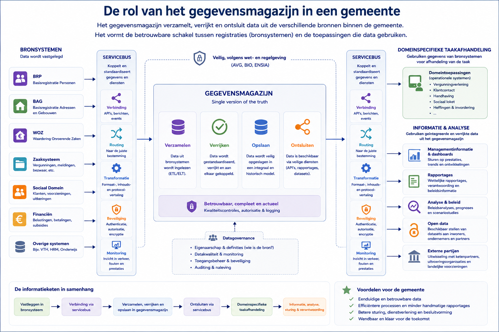

## 1.1 Het gemeentelijk applicatielandschap

Gemeenten voeren honderden wettelijke taken uit — van het bijhouden van persoonsgegevens tot het verlenen van omgevingsvergunningen. Voor al die taken worden applicaties ingezet.

Het gemeentelijk applicatie-landschap is daarom complex. Daarnaast is het applicatielandschap in vrijwel elke gemeenten anders. Dit wordt veroorzaakt door het feit dat gemeenten hiervoor zelf verantwoordelijk zijn. 
Die verschillen ontstaan o.a. door: 
-  verschillen in omvang
-  de beschikbaarheid van ICT- en Architectuur-kennis binnen een gemeente
-  de ambitie om zaken zelf te ontwikkelen danwel van software van leveranciers gebruik te maken. 

Dat leidt om hoofdlijnen tot de volgende indeling, die natuurlijk niet absoluut is: 
-  Grote gemeenten, met name de G4-gemeenten (Utrecht, Rotterdam Den Haag en Amsterdam), zullen veelal onder eigen regie zelf hun applicaties bouwen en beheren. Daarbij is ook vaak sprake van maatwerk.  
-  Middelgrote gemeenten hebben vaak een hybride landschap van standaardsoftware met daarnaast beperkt zelfbouw o maatwerk van leveranciers. 
-  Kleine gemeentes maken over het algemeen gebruik van geïntegreerde suites van leveranciers en zijn ook voor de kennis op ICT-gebied vaak afhankelijk van deze leveranciers. 

In leerlijn 2 gaan dieper in op die complexteit middels de GEMMA (GEMeentelijke Model Architectuur)

### Middelgrote en kleine gemeenten werken veel met pakketten

Anders dan grote commerciële organisaties die veel maatwerk-software laten bouwen, kopen gemeenten over het algemeen **standaardpakketten** van gespecialiseerde leveranciers. Dat heeft een aantal praktische redenen:

- Gemeenten hebben zelf geen ICT-capaciteit nodig om eigen systemen te bouwen en te onderhouden.
- Gemeentelijke taken zijn **grotendeels gelijk**: dezelfde wetgeving (BRP, WOZ, Wabo, Wmo) geldt voor alle 342 gemeenten, dus een pakket van één leverancier werkt voor tientallen afnemers wwarbij middels configuratie vaak de "gemeente-eigen" aspecten kunnen worden ingeregeld. 
- Leveranciers leveren ook **updates bij wetswijzigingen**, zodat de gemeente zelf niet hoeft te programmeren.

In Nederland een relatief kleine groep leveranciers is die het merendeel van de gemeentelijke markt bedient.

#### Bekende leveranciers en hun pakketten

| Domein | Leverancier | Pakket(ten) |
|---|---|---|
| **Burgerzaken (BRP)** | Centric | GovUnite, Key2Burgerzaken |
| **Burgerzaken (BRP)** | PinkRoccade Local Government | iBurgerzaken |
| **Belastingen** | Centric | Key2Belastingen |
| **Belastingen** | GBLT / Heffen | diverse belastingsystemen |
| **Zaakgericht werken** | Rx Mission | Rx.Mission |
| **Zaakgericht werken** | Decos | JOIN |
| **Vergunningen (VTH)** | Centric | Squit XO |
| **Vergunningen (VTH)** | Rx Mission | Rx.Mission |
| **Sociaal domein** | Centric | Suite voor Sociaal Domein (SSD) |
| **Sociaal domein** | Stipter | GWS4all |
| **Financiën** | Unit4 | Unit4 ERPx |
| **Financiën** | Centric | Key2Financiën |
| **Openbare ruimte** | Antea Group | Obsurv |
| **Openbare ruimte** | Gobar | GBI |
| **GIS / Geo** | Esri | ArcGIS |
| **GIS / Geo** | PDOK | diverse basiskaartdiensten |
| **Documentbeheer (DMS)** | Decos | Decos ONE |
| **Documentbeheer (DMS)** | Rx Mission | Rx.Mission DMS |
| **Integratie / ESB** | PinkRoccade | MSB Gemeente |
| **Integratie / ESB** | MuleSoft | Anypoint Platform |

> **Tip:** Je ziet Centric en PinkRoccade Local Government terug in veel domeinen. Dit zijn de twee grootste leveranciers voor de Nederlandse gemeentemarkt. Kennis van hun producten en werkwijze is waardevol.

---

### De samenhang: hoe praten die pakketten met elkaar?

Al die losse pakketten moeten gegevens uitwisselen. Een verhuizing verwerkt in het BRP-systeem moet ook in het belastingsysteem, het sociaal domein-systeem en het zaaksysteem terechtkomen. Pakketten van verschillende leveranciers spreken echter niet automatisch dezelfde taal.

Om de communicatie van gegevens te faciliteren is de **servicebus** ontstaan. Om generiek en meervoudig te gebruiken gegevens te persisteren is het **gegevensmagazijn** ontstaan. Daarnaast is er ook een gemeentelijke uitwisselingsstandaard voor ontworpen (**StUF**)

Op StUF komen we in leerlijn 6 terug.

Een **Enterprise Service Bus** (ESB) — in de gemeentewereld vaak **MSB** (Gemeentelijk Service Bus of Message Service Bus) genoemd — is de digitale postbode van de gemeente. Het is een centraal platform dat berichten tussen applicaties ontvangt, interpreteert en doorstuurt naar de juiste ontvangers.

De servicebus zorgt voor:

- **Routering**: het bericht van BRP gaat naar alle geabonneerde systemen.
- **Transformatie**: als systeem A StUF-XML stuurt en systeem B JSON verwacht, kan de bus omzetten.
- **Logging**: alle berichtenverkeer wordt vastgelegd, wat helpt bij probleemdiagnose.
- **Foutafhandeling**: bij mislukte bezorging wordt een foutmelding gegenereerd en eventueel opnieuw geprobeerd.

De berichten die over de servicebus gaan, volgen standaardformaten. De belangrijkste zijn **StUF** (Standard Uitwisseling Formaat) voor het klassieke landschap en steeds meer **REST API's** voor modernere koppelingen.

### Het gegevensmagazijn

Naast de servicebus — die voor *actuele* gegevensuitwisseling zorgt — hebben gemeenten ook behoefte aan een **historisch overzicht** en aan analyses over meerdere domeinen heen. Daarvoor wordt een **gegevensmagazijn** (ook wel: datawarehouse of datapakhuis) gebruikt.

Een gegevensmagazijn is een aparte gegensopslag waarin gegevens uit meerdere bronsystemen worden samengevoegd, geharmoniseerd en bewaard — ook historisch. Applicaties schrijven over het algemeen niet rechtstreeks naar het gegevensmagazijn; ze leveren data aan, die vervolgens wordt getransformeerd (waar nodig)  en vastgelegd. 

Een gegevensmagazijn voorziet in mogelijkheden voor 

| Toepassing | Voorbeeld |
|---|---|
| **Managementrapportage** | Hoeveel WMO-indicaties zijn verstrekt dit kwartaal? |
| **Beleidsinformatie** | Hoeveel kinderen in bijstandsgezinnen ontvangen jeugdhulp? |
| **Wettelijke verantwoording** | Aanlevering CBS-statistieken, iv3-rapportage |
| **Kwaliteitscontrole** | Is iedereen die in het gegevensmagazijn staat met een BSN ook bekend bij de BRP |
| **Gegevens voor domeinspecieke taakafhandeling leveren** | Gegevens uit basisregistraties of uit andere domeinen die nodig zijn voor de afhandeling van een taak |

---

### Samenhang in één beeld

Hieronder staat het een geabstraheerd overzicht van de componenten die in het gemeentelijk applicatie landschap relevant zijn. 

---

### Wat is de rol van KenniscentrumArchtiectuur in deze context

Het Kenniscentrum Architectuur van de VNG (Vereniging van Nederlandse Gemeenten) heeft grofweg de rol om gemeenten te ondersteunen bij het ontwerpen, harmoniseren en toepassen van informatie- en enterprise-architectuur in het gemeentelijk IT- en gegevenslandschap.

Hier is een compacte schets, toegespitst op jouw onderwerpen:

1. Basisregistraties

Het Kenniscentrum Architectuur (KCA) helpt gemeenten om basisregistraties (zoals BRP, BAG, BGT, WOZ, etc.) consistent en herbruikbaar in te zetten binnen het gemeentelijk landschap.

Definieert architectuurprincipes voor gebruik van basisregistraties
Bewaakt samenhang tussen landelijke stelselafspraken en gemeentelijke implementatie
Stimuleert “eenmalige opslag, meervoudig gebruik”
Zorgt dat gemeenten aansluiten op het Stelsel van Basisregistraties via generieke patronen

Kort gezegd: vertalen van landelijke registratie-afspraken naar toepasbare gemeentelijke architectuurkeuzes.

2. Gemeentelijk applicatielandschap

Het KCA ondersteunt bij het inrichten van een gestandaardiseerd en beheersbaar applicatielandschap.

Referentiearchitecturen voor gemeentelijke domeinen (sociaal, fysiek, dienstverlening)
Richtlijnen voor modulair en koppelbaar applicatielandschap
Sturing op “common components” (bijv. zaakgericht werken, DMS, API-gateways)
Verminderen van vendor lock-in en legacy-verkokeringKun je in 

Kern: van losse applicaties naar samenhangende domeinarchitectuur.

3. Gegevenspersistentie

Het KCA geeft richting aan hoe en waar gegevens duurzaam worden opgeslagen en beheerd.

Principes voor “system of record” vs “system of engagement”
Scheiding tussen registratie, verwerking en presentatie
Bevorderen van bronregistraties en authentieke gegevensbronnen
Sturing op datakwaliteit, herkomst en lifecycle

Kern: duidelijk maken welke systemen leidend zijn voor welke data en hoe lang die betrouwbaar beschikbaar blijft.

4. Gegevensuitwisseling

Een belangrijk speerpunt is het standaardiseren van hoe gegevens tussen systemen en organisaties worden uitgewisseld.

Bevorderen van API-first en gestandaardiseerde koppelvlakken
Gebruik van landelijke standaarden (zoals NLX, Stelselcatalogus, Common Ground principes)
Architectuurpatronen voor event-driven en service-based integratie
Verminderen van point-to-point koppelingen

Kern: van starre koppelingen naar gestandaardiseerde, herbruikbare gegevensuitwisseling.

Overkoepelende rol

In één zin:

Het Kenniscentrum Architectuur van de VNG ontwikkelt en bewaakt de referentiearchitectuur en principes waarmee gemeenten hun informatievoorziening rond basisregistraties, applicaties, dataopslag en gegevensuitwisseling consistent, schaalbaar en toekomstvast kunnen inrichten.

### Wat betekent dit voor de informatie-analist?

Als informatie-analist werk je niet aan de binnenkant van een pakket — dat doen de leveranciers. Jouw rol is om te begrijpen **hoe gegevens stromen** en **hoe systemen gekoppeld zijn**. Concreet betekent dit:

| Vraagstuk | Jouw rol |
|---|---|
| Twee systemen moeten gegevens uitwisselen | Je stelt de **koppelvlakspecificatie** op: welke gegevens, in welk formaat, via welk protocol |
| Een nieuw pakket wordt aangeschaft | Je analyseert welke koppelingen nodig zijn en welke standaarden het pakket ondersteunt |
| Gegevenskwaliteit is slecht | Je traceert in welk bronsysteem het fout gaat en hoe de fout zich via de servicebus verspreidt |
| Beleid wil een nieuw rapport | Je bepaalt welke bronsystemen de benodigde data leveren en hoe het gegevensmagazijn gevoed moet worden |
| Een leverancier gaat stoppen met StUF-ondersteuning | Je analyseert de impact op alle gekoppelde systemen en stelt een migratieplan op |

Het gemeentelijk ICT-landschap is complex, maar heeft een herkenbare structuur: **pakketten** als bronnen, **servicebussen** voor actuele uitwisseling, en **gegevensmagazijnen** voor analyse en rapportage. Door die structuur te begrijpen, kun je als informatie-analist weloverwogen adviseren — ongeacht welke specifieke pakketten een gemeente gebruikt.
