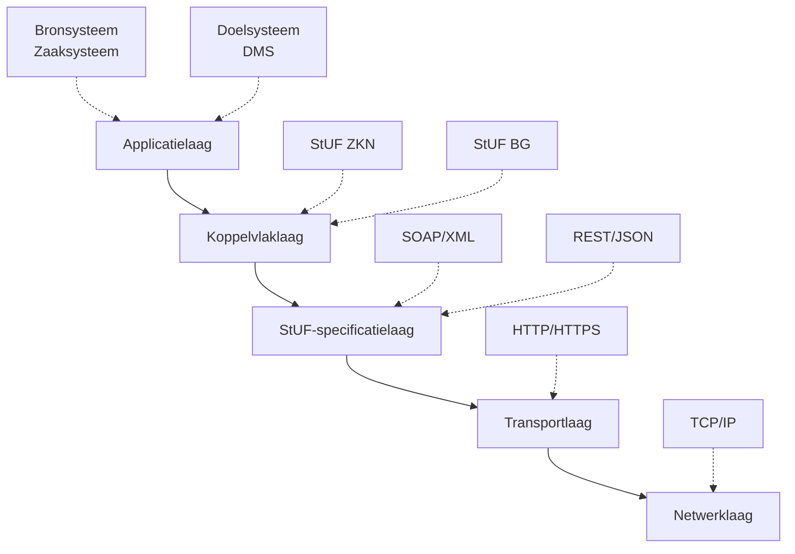
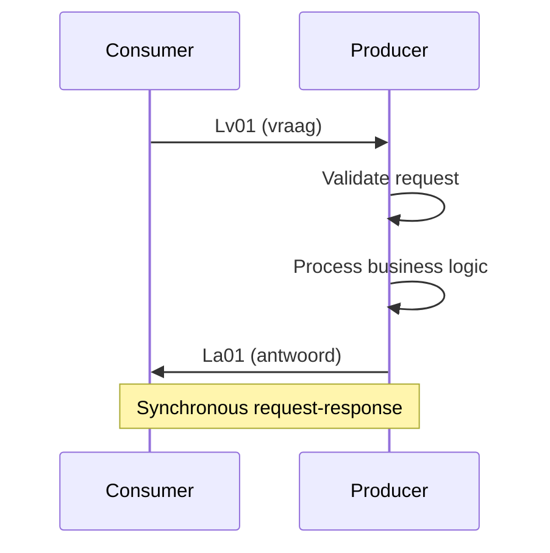
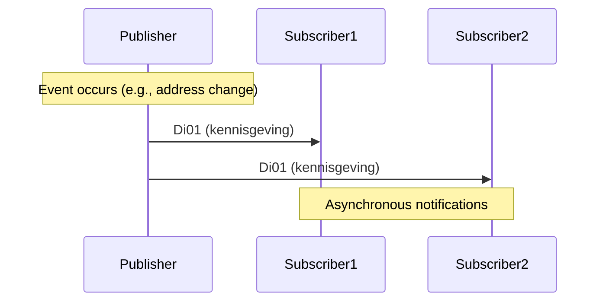

## 6.1 Opbouw en werking van StUF

Kan de opbouw en werking van de StUF-standaard (Standaard Uitwisseling Formaat) uitleggen.

### Wat is StUF?

**StUF** (Standaard Uitwisseling Formaat) is een Nederlandse standaard voor berichtgebaseerde gegevensuitwisseling tussen informatiesystemen in de overheid. StUF biedt een gestandaardiseerde manier voor systemen om gestructureerd informatie uit te wisselen, onafhankelijk van de onderliggende technologie.

#### Kernprincipes van StUF:

- **Standaardisatie**: Uniforme manier van gegevensuitwisseling
- **Platform-onafhankelijk**: Werkt met verschillende technologieën
- **Semantische interoperabiliteit**: Eenduidige betekenis van gegevens
- **Berichtgebaseerd**: Asynchroon en synchroon berichtenverkeer

### StUF-architectuur

#### Lagenmodel

StUF is opgebouwd volgens een gelaagde architectuur:



#### Componenten-overzicht

**1. Onderlaag (Foundation Layer)**
- Basisstructuren voor berichten
- Gemeenschappelijke datatypen
- Identificatie en tijdsstempeling

**2. Sectormodel**
- Domein-specifieke informatiemodellen (RSGB, RSGB-BGT)
- Business-objecten en relaties
- Sectorspecifieke regels

**3. Koppelvlakspecificatie**
- StUF-BG (Basisgegevens)
- StUF-ZKN (Zaak- en Documentservices)
- StUF-ZTC (Zaaktype Catalogus)

**4. Berichtspecificatie**
- Request/response-berichten
- Kennisgevingsberichten
- Synchronisatieberichten

### StUF-berichtstructuur

#### Basis StUF-bericht

```xml
<?xml version="1.0" encoding="UTF-8"?>
<StUF:Bv03Bericht 
    xmlns:StUF="http://www.stufstandaarden.nl/koppelvlak/stuf" 
    xmlns:BG="http://www.stufstandaarden.nl/onderlaag/bg"
    xmlns:xsi="http://www.w3.org/2001/XMLSchema-instance"
    xsi:schemaLocation="http://www.stufstandaarden.nl/koppelvlak/stuf BG0310_msg.xsd">
    
    <!-- Stuurgegevens definieren routing en metadata -->
    <StUF:stuurgegevens>
        <StUF:berichtcode>Lv01</StUF:berichtcode>
        <StUF:zender>
            <StUF:organisatie>0363</StUF:organisatie>
            <StUF:applicatie>BRP-GWS</StUF:applicatie>
            <StUF:gebruiker>sys_user_brp</StUF:gebruiker>
        </StUF:zender>
        <StUF:ontvanger>
            <StUF:organisatie>0518</StUF:organisatie>
            <StUF:applicatie>ZAAK-DMS</StUF:applicatie>
        </StUF:ontvanger>
        <StUF:referentienummer>REF-2024-001-7856</StUF:referentienummer>
        <StUF:tijdstempel>20240305143000</StUF:tijdstempel>
        <StUF:entiteittype>NPS</StUF:entiteittype>
    </StUF:stuurgegevens>
    
    <!-- Parameters specificeren zoek- of actiecriteria -->
    <StUF:parameters>
        <StUF:indicatorVervolgvraag>false</StUF:indicatorVervolgvraag>
        <StUF:indicatorAfnemingsbepaling>false</StUF:indicatorVervolgvraag>
    </StUF:parameters>
    
    <!-- Body bevat de feitelijke business-data -->
    <StUF:gelijk>
        <BG:object StUF:entiteittype="NPS">
            <BG:burgerservicenummer>123456789</BG:burgerservicenummer>
        </BG:object>
    </StUF:gelijk>
</StUF:Bv03Bericht>
```

#### Stuurgegevens-componenten

**Berichtrouting:**
```xml
<StUF:stuurgegevens>
    <!-- Berichttype identificatie -->
    <StUF:berichtcode>Lv01</StUF:berichtcode>
    
    <!-- Afzender identificatie -->
    <StUF:zender>
        <StUF:organisatie>0363</StUF:organisatie>      <!-- CBS-code gemeente -->
        <StUF:applicatie>BRP-Service</StUF:applicatie>  <!-- Systeem naam -->
        <StUF:administratie>01</StUF:administratie>      <!-- Optional: administratie -->
        <StUF:gebruiker>api_user_001</StUF:gebruiker>   <!-- Technical user -->
    </StUF:zender>
    
    <!-- Ontvanger identificatie -->
    <StUF:ontvanger>
        <StUF:organisatie>0518</StUF:organisatie>
        <StUF:applicatie>Zaak-DMS-v3</StUF:applicatie>
    </StUF:ontvanger>
    
    <!-- Bericht tracking -->
    <StUF:referentienummer>REF-BRP-20240305-001</StUF:referentienummer>
    <StUF:tijdstempel>20240305143015</StUF:tijdstempel>
    <StUF:functie>vraag</StUF:functie>
</StUF:stuurgegevens>
```

**Optionele cross-reference:**
```xml
<StUF:stuurgegevens>
    <!-- Cross-reference naar eerder bericht -->
    <StUF:crossRefnummer>REF-ZAAK-20240305-045</StUF:crossRefnummer>    
    
    <!-- Entiteit waar het bericht betrekking op heeft -->
    <StUF:entiteittype>NPS</StUF:entiteittype>
</StUF:stuurgegevens>
```

### StUF-berichttypen

#### 1. Vraag-/Antwoord-berichten (Request/Response)

**Vraagbericht (Lv01):**
```xml
<StUF:Lv01Bericht>
    <StUF:stuurgegevens>
        <StUF:berichtcode>Lv01</StUF:berichtcode>
        <StUF:functie>vraag</StUF:functie>
    </StUF:stuurgegevens>
    
    <StUF:gelijk>
        <BG:object StUF:entiteittype="NPS">
            <BG:burgerservicenummer>123456789</BG:burgerservicenummer>
        </BG:object>
    </StUF:gelijk>
</StUF:Lv01Bericht>
```

**Antwoordbericht (La01):**
```xml
<StUF:La01Bericht>
    <StUF:stuurgegevens>
        <StUF:berichtcode>La01</StUF:berichtcode>
        <StUF:functie>antwoord</StUF:functie>
        <StUF:crossRefnummer>REF-BRP-20240305-001</StUF:crossRefnummer>
    </StUF:stuurgegevens>
    
    <StUF:antwoord>
        <BG:object StUF:entiteittype="NPS" StUF:verwerkingssoort="I">
            <BG:burgerservicenummer>123456789</BG:burgerservicenummer>
            <BG:geslachtsnaam>
                <BG:voorvoegselGeslachtsnaam>van der</BG:voorvoegselGeslachtsnaam>
                <BG:geslachtsnaam>Berg</BG:geslachtsnaam>
            </BG:geslachtsnaam>
            <BG:voornamen>Jan Peter</BG:voornamen>
            <BG:geboortedatum>19850315</BG:geboortedatum>
        </BG:object>
    </StUF:antwoord>
</StUF:La01Bericht>
```

#### 2. Kennisgevingsberichten (Notifications)

**Meldingsbericht (Di01):**
```xml
<StUF:Di01Bericht>
    <StUF:stuurgegevens>
        <StUF:berichtcode>Di01</StUF:berichtcode>
        <StUF:functie>kennisgeving</StUF:functie>
        <StUF:entiteittype>NPS</StUF:entiteittype>
    </StUF:stuurgegevens>
    
    <StUF:body>
        <BG:object StUF:entiteittype="NPS" StUF:verwerkingssoort="W">
            <BG:burgerservicenummer>123456789</BG:burgerservicenummer>
            <BG:adresAanduidingGegeven StUF:verwerkingssoort="W">
                <BG:woonplaatsWoongebied>Amsterdam</BG:woonplaatsWoongebied>
                <BG:straatnaam>Nieuwe Hoofdstraat</BG:straatnaam>
                <BG:huisnummer>45</BG:huisnummer>
                <BG:postcode>1012AB</BG:postcode>
            </BG:adresAanduidingGegeven>
        </BG:object>
    </StUF:body>
</StUF:Di01Bericht>
```

#### 3. Synchronisatieberichten

**Synchronisatievraag (Sv01):**
```xml
<StUF:Sv01Bericht>
    <StUF:stuurgegevens>
        <StUF:berichtcode>Sv01</StUF:berichtcode>
        <StUF:functie>synchronisatieVraag</StUF:functie>
    </StUF:stuurgegevens>
    
    <StUF:parameters>
        <StUF:mutatiesoort>W</StUF:mutatiesoort>
        <StUF:indicatorVervolgvraag>false</StUF:indicatorVervolgvraag>
    </StUF:parameters>
    
    <StUF:scope>
        <BG:object StUF:entiteittype="NPS">
            <BG:tijdvakGeldigheid>
                <StUF:beginGeldigheid>20240301000000</StUF:beginGeldigheid>
                <StUF:eindGeldigheid>20240305235959</StUF:eindGeldigheid>
            </BG:tijdvakGeldigheid>
        </BG:object>
    </StUF:scope>
</StUF:Sv01Bericht>
```

### Verwerkingssoorten (Processing Types)

StUF gebruikt verwerkingssoorten om het type mutatie aan te geven:

| Code | Betekenis | Gebruik |
|------|-----------|---------|
| **T** | Toevoeging | Nieuw object wordt aangemaakt |
| **W** | Wijziging | Bestaand object wordt gewijzigd |
| **V** | Verwijdering | Object wordt verwijderd |
| **I** | Identificatie | Object wordt alleen geïdentificeerd (geen mutatie) |
| **S** | Synchronisatie | Volledige herwaardering object-status |

#### Voorbeeld verwerkingsoorten

```xml
<!-- Nieuw persoon toevoegen -->
<BG:object StUF:entiteittype="NPS" StUF:verwerkingssoort="T">
    <BG:burgerservicenummer>987654321</BG:burgerservicenummer>
    <BG:voornamen>Maria</BG:voornamen>
    <BG:geslachtsnaam>
        <BG:geslachtsnaam>Jansen</BG:geslachtsnaam>
    </BG:geslachtsnaam>
</BG:object>

<!-- Adres wijzigen -->
<BG:object StUF:entiteittype="NPS" StUF:verwerkingssoort="W">
    <BG:burgerservicenummer>123456789</BG:burgerservicenummer>
    <BG:adresAanduidingGegeven StUF:verwerkingssoort="W">
        <BG:straatnaam>Dorpsstraat</BG:straatnaam>
        <BG:huisnummer>12</BG:huisnummer>
        <BG:postcode>3456CD</BG:postcode>
    </BG:adresAanduidingGegeven>
</BG:object>

<!-- Persoon verwijderen -->
<BG:object StUF:entiteittype="NPS" StUF:verwerkingssoort="V">
    <BG:burgerservicenummer>555666777</BG:burgerservicenummer>
</BG:object>
```

### StUF-tijdlijnen en geldigheid

#### Materiële en formele historie

StUF onderscheidt twee tijdlijnen:

**Materiële historie (tijdvakGeldigheid):**
```xml
<!-- Wanneer was iets geldig in de werkelijkheid -->
<BG:object StUF:entiteittype="NPS">
    <BG:tijdvakGeldigheid>
        <StUF:beginGeldigheid>20240101000000</StUF:beginGeldigheid>
        <StUF:eindGeldigheid StUF:noValue="nietGeautoriseerd" />
    </BG:tijdvakGeldigheid>
</BG:object>
```

**Formele historie (tijdstipRegistratie):**
```xml
<!-- Wanneer werd iets geregistreerd in het systeem -->
<BG:object StUF:entiteittype="NPS">
    <BG:tijdstipRegistratie>20240105143000</BG:tijdstipRegistratie>
    <BG:eindRegistratie StUF:noValue="geenWaarde" />
</BG:object>
```

### StUF-foutafhandeling

#### Foutberichten (Fo01)

```xml
<StUF:Fo01Bericht>
    <StUF:stuurgegevens>
        <StUF:berichtcode>Fo01</StUF:berichtcode>
        <StUF:functie>fout</StUF:functie>
        <StUF:crossRefnummer>REF-BRP-20240305-001</StUF:crossRefnummer>
    </StUF:stuurgegevens>
    
    <StUF:body>
        <StUF:code>StUF057</StUF:code>
        <StUF:plek>http://www.gemeente.nl/BRP-GWS</StUF:plek>
        <StUF:omschrijving>BSN niet gevonden in gegevensregistratie</StUF:omschrijving>
        <StUF:details>
            Er is geen persoon gevonden met BSN 123456789 in de BRP-registratie
        </StUF:details>
    </StUF:body>
</StUF:Fo01Bericht>
```

#### Veel voorkomende StUF-foutcodes

| Code | Omschrijving | Oorzaak |
|------|--------------|---------|
| StUF001 | Validatiefout XML | Schema-validatie gefaald |
| StUF013 | Autorisatiefout | Onvoldoende rechten |
| StUF057 | Object niet gevonden | Entiteit bestaat niet |
| StUF058 | Dubbel object | Object bestaat al |
| StUF067 | Parameter onjuist | Verkeerde parameterwaarde |
| StUF070 | Technische storing | Systeem niet beschikbaar |

### StUF-namespaces en schema's

#### Namespace-structuur

```xml
<!-- Basis StUF-namespace -->
xmlns:StUF="http://www.stufstandaarden.nl/koppelvlak/stuf"

<!-- Onderlaag-namespaces -->
xmlns:BG="http://www.stufstandaarden.nl/onderlaag/bg"
xmlns:geo="http://www.stufstandaarden.nl/onderlaag/geo" 

<!-- Sectormodel-namespaces -->
xmlns:zkn="http://www.stufstandaarden.nl/sectormodel/zkn"
xmlns:rgbz="http://www.stufstandaarden.nl/sectormodel/rgbz"

<!-- XML Schema instance -->
xmlns:xsi="http://www.w3.org/2001/XMLSchema-instance"
```

#### Schema-validatie

```xml
<StUF:Lv01Bericht 
    xsi:schemaLocation="http://www.stufstandaarden.nl/koppelvlak/stuf 
                        http://www.stufstandaarden.nl/schemas/stuf0301/StUF0301_msg.xsd
                        http://www.stufstandaarden.nl/onderlaag/bg
                        http://www.stufstandaarden.nl/schemas/bg0310/BG0310_cat.xsd">
```

### StUF-implementatie patterns

#### Producer-Consumer patroon



#### Publisher-Subscriber patroon



### StUF-ontwerpprincipes

#### 1. Ontkoppeling
- **Technisch**: Verschillende systemen kunnen StUF-berichten uitwisselen
- **Semantisch**: Business-logica gescheiden van transport
- **Temporeel**: Asynchroon berichtverkeer mogelijk

#### 2. Standaardisatie
- **Gestandaardiseerde berichten**: Voorgedefinieerde bericht-types
- **Uniforme structuur**: Consistente opbouw over sectoren
- **Gedeelde vocabulaire**: Eenduidige semantiek

#### 3. Herbruikbaarheid
- **Onderlaag**: Herbruikbare basis-componenten
- **Sectormodellen**: Domein-specifieke uitbreidingen
- **Koppelvlakken**: Concrete implementatie-specificaties

StUF vormt de ruggengraat van gegevensuitwisseling binnen de Nederlandse overheid en faciliteert interoperabiliteit tussen gemeentelijke informatiesystemen. Het begrip van de opbouw en werking is essentieel voor effectieve implementatie en beheer van geïntegreerde overheidsarchitecturen.

**Resources:**
- [StUF Standaard Website](http://www.stufstandaarden.nl)
- [GEMMA Online StUF-documentatie](https://www.gemmaonline.nl/index.php/StUF)
- [VNG Realisatie StUF-specificaties](https://vng-realisatie.github.io/StUF-Standaarden/)