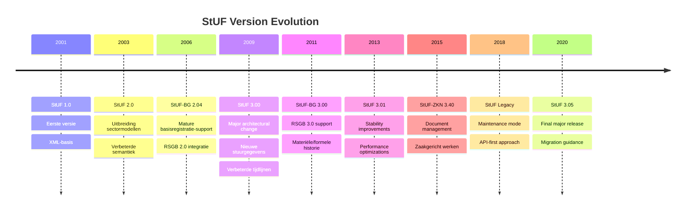

## 6.2 Versies van de StUF-standaard

Kent de verschillende versies van de StUF-standaard en de onderlinge verschillen.

### StUF-versie geschiedenis

De StUF-standaard heeft zich de afgelopen decennia in meerdere versies ontwikkeld, waarbij elke versie nieuwe functionaliteit, verbeteringen en soms ook incompatible wijzigingen introduceert.

#### StUF-chronologie



### StUF 1.0 - 2.0 (2001-2005)

#### Pioniersfase

**StUF 1.0 Kenmerken:**
- Eerste XML-gebaseerde uitwisselingsstandaard
- Simpele berichtstructuur
- Beperkte sectormodel-ondersteuning
- Focus op technische interoperabiliteit

```xml
<!-- StUF 1.0 voorbeeld (gelijkaardigd) -->
<stuf:bericht xmlns:stuf="http://www.stufstandaarden.nl/stuf/1.0">
    <stuf:header>
        <stuf:afzender>gemeente_amsterdam</stuf:afzender>
        <stuf:ontvanger>provincie_noord_holland</stuf:ontvanger>
    </stuf:header>
    <stuf:body>
        <bg:persoon>
            <bg:bsn>123456789</bg:bsn>
            <bg:naam>Jan Berg</bg:naam>
        </bg:persoon>
    </stuf:body>
</stuf:bericht>
```

**StUF 2.0 Verbeteringen:**
- Uitgebreide sectormodellen (RSGB 1.0)
- Betere namespace-structuur
- Introductie van entiteittypes
- Formalisering van koppelvlak-specificaties

### StUF 3.00 (2009) - Architecturale Revolutie

#### Belangrijkste wijzigingen

**Nieuwe berichtstructuur:**
```xml
<StUF:Lv01Bericht 
    xmlns:StUF="http://www.stufstandaarden.nl/koppelvlak/stuf"
    xmlns:BG="http://www.stufstandaarden.nl/onderlaag/bg"
    xmlns:xsi="http://www.w3.org/2001/XMLSchema-instance"
    xsi:schemaLocation="http://www.stufstandaarden.nl/koppelvlak/stuf stuf0301.xsd">
    
    <!-- Aangescherpte stuurgegevens -->
    <StUF:stuurgegevens>
        <StUF:berichtcode>Lv01</StUF:berichtcode>
        <StUF:zender>
            <StUF:organisatie>0363</StUF:organisatie>
            <StUF:applicatie>BRP-GBA-V</StUF:applicatie>
            <StUF:administratie>GBA</StUF:administratie>
            <StUF:gebruiker>sys_gba</StUF:gebruiker>
        </StUF:zender>
        <StUF:ontvanger>
            <StUF:organisatie>0518</StUF:organisatie>
            <StUF:applicatie>ZAAKSYSTEEM</StUF:applicatie>
        </StUF:ontvanger>
        <StUF:referentienummer>GBA20090301001</StUF:referentienummer>
        <StUF:tijdstempel>20090301120000</StUF:tijdstempel>
        <StUF:entiteittype>NPS</StUF:entiteittype>
    </StUF:stuurgegevens>
    
    <!-- Formele parameters -->
    <StUF:parameters>
        <StUF:indicatorVervolgvraag>false</StUF:indicatorVervolgvraag>
    </StUF:parameters>
    
    <!-- Content met verwerkingssoorten -->
    <StUF:gelijk>
        <BG:object StUF:entiteittype="NPS" StUF:verwerkingssoort="I">
            <BG:burgerservicenummer>123456789</BG:burgerservicenummer>
        </BG:object>
    </StUF:gelijk>
</StUF:Lv01Bericht>
```

**Vernieuwingen in StUF 3.00:**

1. **Stuurgegevens-uitbreiding:**
   - Administratie-niveau toegevoegd
   - Gebruiker-identificatie
   - Verbeterde tijdstempel-precisie

2. **Verwerkingssoorten:**
   ```xml
   StUF:verwerkingssoort="T" (Toevoeging)
   StUF:verwerkingssoort="W" (Wijziging)  
   StUF:verwerkingssoort="V" (Verwijdering)
   StUF:verwerkingssoort="I" (Identificatie)
   ```

3. **Tijdlijn-ondersteuning:**
   ```xml
   <BG:tijdvakGeldigheid>
       <StUF:beginGeldigheid>20090101000000</StUF:beginGeldigheid>
       <StUF:eindGeldigheid>20091231235959</StUF:eindGeldigheid>
   </BG:tijdvakGeldigheid>
   ```

4. **NoValue-mechanisme:**
   ```xml
   <!-- Verschillende redenen voor lege waarden -->
   <BG:voornamen StUF:noValue="nietGeautoriseerd" />
   <BG:geslacht StUF:noValue="geenWaarde" />  
   <BG:overlijdensdatum StUF:noValue="vastgesteldOnbekend" />
   ```

Het begrijpen van verschillende StUF-versies is cruciaal voor het beheren van bestaande systemen en het plannen van migraties naar moderne API-architecturen. Elke versie heeft specifieke capabilities die besluitvorming rond systeem-integratie beïnvloeden.

**Resources:**
- [StUF Standaard Versiehistorie](https://www.gemmaonline.nl/index.php/StUF)
- [VNG Realisatie StUF-documentatie](https://vng-realisatie.github.io/StUF-Standaarden/)