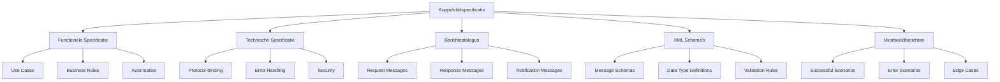

## 6.3 Koppelvlakspecificaties

Kan StUF-koppelvlakspecificaties opstellen, lezen en beheren.

### Wat zijn koppelvlakspecificaties?

Een **koppelvlakspecificatie** is een document dat precies beschrijft hoe twee systemen met elkaar kunnen communiceren via StUF-berichten. Het definieert de berichten, scenario's, en business-regels die nodig zijn voor succesvolle gegevensuitwisseling.

#### Componenten van een koppelvlakspecificatie:

- **Functionele specificatie**: Wat wordt uitgewisseld en waarom
- **Technische specificatie**: Hoe wordt het uitgewisseld
- **Berichtcatalogus**: Welke berichten zijn beschikbaar
- **Scenario's**: Workflows en use cases
- **Schema's**: XML-schema definities
- **Implementatie-voorbeelden**: Concrete berichten

### Structuur van een koppelvlakspecificatie



### StUF-BG Koppelvlakspecificatie

#### Basisgegevens koppelvlak

**StUF-BG specificatie componenten:**

```yaml
stuf_bg_specificatie:
  naam: "StUF-BG 3.10"
  versie: "3.10.00"
  publicatiedatum: "2011-11-01"
  
  doelgroep:
    - "BRP/GBA leveranciers"
    - "Gemeente ICT-afdelingen"  
    - "Zaaksysteem leveranciers"
    
  scope:
    - "Natuurlijke personen (NPS)"
    - "Niet-natuurlijke personen (NNP)"
    - "Vestigingen (VES)"
    - "Adressen (AOA)"
    - "Nummeraanduidingen (NAG)"
    
  berichten:
    vraag_antwoord:
      - "Lv01/La01 - Vraag/Antwoord"
      - "Lv02/La02 - Detail vraag/antwoord"
    kennisgevingen:
      - "Lk01 - Objectkennisgeving"
      - "Lk02 - Beëindiging abonnement"
    synchronisatie:
      - "Sv01/Sa01 - Synchronisatie vraag/antwoord"
      - "Sh01 - Historievraag"
```

Het opstellen en beheren van StUF-koppelvlakspecificaties vereist grondige kennis van zowel de technische als functionele aspecten van gegevensuitwisseling. Een goede specificatie is de basis voor succesvolle systeemintegratie en interoperabiliteit binnen de overheid.

**Resources:**
- [StUF Testplatform](https://www.stuftest.nl/)
- [GEMMA Koppelvlakspecificaties](https://www.gemmaonline.nl/)