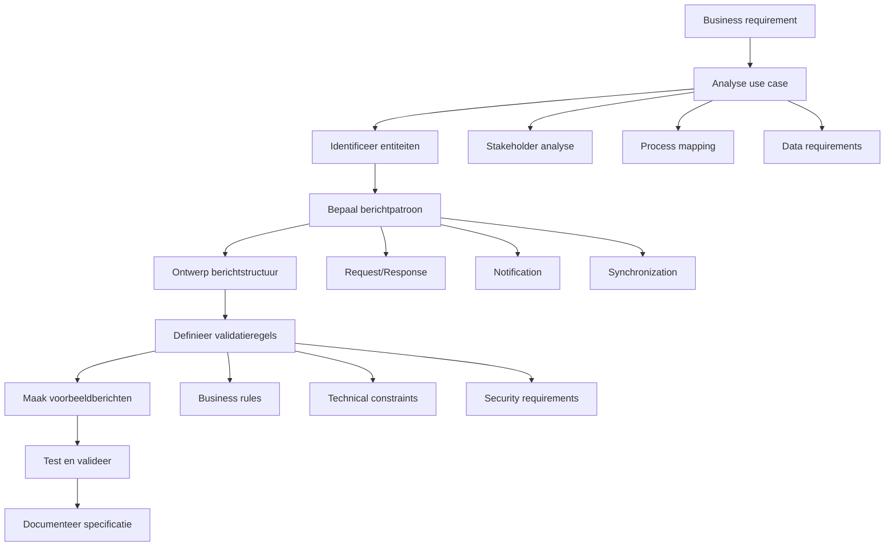

## 6.4 StUF-berichten ontwerpen

Kan StUF-berichten ontwerpen waarmee gegevens uitgewisseld worden.

### Berichtontwerp-principes

Het ontwerpen van effectieve StUF-berichten vereist aandacht voor zowel functionele als technische aspecten. Een goed ontworpen bericht faciliteert betrouwbare gegevensuitwisseling en ondersteunt business-processen optimaal.

#### Ontwerpoverwegingen

**Functionele aspecten:**
- **Doel**: Wat wil je bereiken met het bericht?
- **Context**: In welk business-proces wordt het gebruikt?
- **Stakeholders**: Wie zijn zender en ontvanger?
- **Gegevens**: Welke informatie moet worden uitgewisseld?
- **Timing**: Wanneer wordt het bericht verstuurd?

**Technische aspecten:**
- **Berichttype**: Vraag/antwoord, kennisgeving, of synchronisatie?
- **Entiteiten**: Welke objecten zijn betrokken?  
- **Cardinaliteit**: Eén object of meerdere objecten?
- **Filtering**: Welke selectiecriteria zijn nodig?
- **Validatie**: Welke controles zijn vereist?

### Berichtontwerp-workflow



### Berichtpatronen

#### 1. Vraag/Antwoord-patroon (Request/Response)

**Use case**: Zaaksysteem vraagt persoonsgegevens op

**Ontwerp-beslissingen:**
```yaml
pattern: "Request/Response"
request_message: "Lv01"
response_message: "La01"
entity_type: "NPS"
business_goal: "Persoon verificatie voor zaakbehandeling"
security_level: "Hoog - persoonsgegevens"
performance: "Synchroon - real-time response vereist"
```

**Request-ontwerp (Lv01):**
```xml
<StUF:Lv01Bericht 
    xmlns:StUF="http://www.stufstandaarden.nl/koppelvlak/stuf"
    xmlns:BG="http://www.stufstandaarden.nl/onderlaag/bg">
    
    <StUF:stuurgegevens>
        <StUF:berichtcode>Lv01</StUF:berichtcode>
        <StUF:zender>
            <StUF:organisatie>0518</StUF:organisatie>
            <StUF:applicatie>ZaakDMS-Pro</StUF:applicatie>
            <StUF:administratie>ZAAK</StUF:administratie>
            <StUF:gebruiker>zaakbehandelaar_001</StUF:gebruiker>
        </StUF:zender>
        <StUF:ontvanger>
            <StUF:organisatie>0363</StUF:organisatie>
            <StUF:applicatie>BRP-Gateway</StUF:applicatie>
        </StUF:ontvanger>
        <StUF:referentienummer>ZAAK-2024-REQ-001234</StUF:referentienummer>
        <StUF:tijdstempel>20240305143000</StUF:tijdstempel>
        <StUF:entiteittype>NPS</StUF:entiteittype>
    </StUF:stuurgegevens>
    
    <!-- Parameters voor response-filtering -->
    <StUF:parameters>
        <StUF:indicatorVervolgvraag>false</StUF:indicatorVervolgvraag>
        <StUF:indicatorAfnemingsbepaling>true</StUF:indicatorAfnemingsbepaling>
    </StUF:parameters>
    
    <!-- Primaire zoekcriteria -->
    <StUF:gelijk>
        <BG:object StUF:entiteittype="NPS">
            <BG:burgerservicenummer>123456789</BG:burgerservicenummer>
        </BG:object>
    </StUF:gelijk>
    
    <!-- Scope: welke gegevens gewenst? -->
    <StUF:scope>
        <BG:object StUF:entiteittype="NPS">
            <BG:burgerservicenummer />
            <BG:geslachtsnaam />
            <BG:voornamen />
            <BG:geboortedatum />
            <BG:adresAanduidingGegeven>
                <BG:woonplaatsWoongebied />
                <BG:straatnaam />
                <BG:huisnummer />
                <BG:postcode />
            </BG:adresAanduidingGegeven>
        </BG:object>
    </StUF:scope>
</StUF:Lv01Bericht>
```

**Response-ontwerp (La01):**
```xml
<StUF:La01Bericht 
    xmlns:StUF="http://www.stufstandaarden.nl/koppelvlak/stuf"
    xmlns:BG="http://www.stufstandaarden.nl/onderlaag/bg">
    
    <StUF:stuurgegevens>
        <StUF:berichtcode>La01</StUF:berichtcode>
        <StUF:zender>
            <StUF:organisatie>0363</StUF:organisatie>
            <StUF:applicatie>BRP-Gateway</StUF:applicatie>
        </StUF:zender>
        <StUF:ontvanger>
            <StUF:organisatie>0518</StUF:organisatie>
            <StUF:applicatie>ZaakDMS-Pro</StUF:applicatie>
            <StUF:gebruiker>zaakbehandelaar_001</StUF:gebruiker>
        </StUF:ontvanger>
        <StUF:referentienummer>BRP-2024-RESP-001234</StUF:referentienummer>
        <StUF:crossRefnummer>ZAAK-2024-REQ-001234</StUF:crossRefnummer>
        <StUF:tijdstempel>20240305143005</StUF:tijdstempel>
        <StUF:entiteittype>NPS</StUF:entiteittype>
    </StUF:stuurgegevens>
    
    <!-- Persoon-gegevens conform scope -->
    <StUF:antwoord>
        <BG:object StUF:entiteittype="NPS" StUF:verwerkingssoort="I">
            <BG:burgerservicenummer>123456789</BG:burgerservicenummer>
            
            <!-- Authentiek-markering -->
            <BG:authenticatiegegevenNP>
                <BG:authentiek>J</BG:authentiek>
            </BG:authenticatiegegevenNP>
            
            <!-- Naam-gegevens -->
            <BG:geslachtsnaam>
                <BG:voorvoegselGeslachtsnaam>van der</BG:voorvoegselGeslachtsnaam>
                <BG:geslachtsnaam>Berg</BG:geslachtsnaam>
            </BG:geslachtsnaam>
            <BG:voornamen>Jan Peter</BG:voornamen>
            <BG:geboortedatum>19850315</BG:geboortedatum>
            
            <!-- Adres-gegevens -->
            <BG:adresAanduidingGegeven>
                <BG:authentiek>J</BG:authentiek>
                <BG:woonplaatsWoongebied>Amsterdam</BG:woonplaatsWoongebied>
                <BG:straatnaam>Hoofdstraat</BG:straatnaam>
                <BG:huisnummer>42</BG:huisnummer>
                <BG:postcode>1012AB</BG:postcode>
                
                <!-- Geldigheids-periode -->
                <BG:tijdvakGeldigheid>
                    <StUF:beginGeldigheid>20240101000000</StUF:beginGeldigheid>
                    <StUF:eindGeldigheid StUF:noValue="geenWaarde"/>
                </BG:tijdvakGeldigheid>
            </BG:adresAanduidingGegeven>
        </BG:object>
    </StUF:antwoord>
</StUF:La01Bericht>
```

#### 2. Kennisgeving-patroon (Notification)

**Use case**: BRP meldt adreswijziging aan geabonneerde systemen

**Ontwerp-beslissingen:**
```yaml
pattern: "Notification"
message_type: "Lk01"
trigger: "Address change in BRP"
delivery: "Asynchroon naar geabonneerde systemen"  
processing: "Fire-and-forget met optional acknowledgment"
subscription_based: true
```

**Kennisgeving-ontwerp (Lk01):**
```xml
<StUF:Lk01Bericht 
    xmlns:StUF="http://www.stufstandaarden.nl/koppelvlak/stuf"
    xmlns:BG="http://www.stufstandaarden.nl/onderlaag/bg">
    
    <StUF:stuurgegevens>
        <StUF:berichtcode>Lk01</StUF:berichtcode>
        <StUF:zender>
            <StUF:organisatie>0363</StUF:organisatie>
            <StUF:applicatie>BRP-Publisher</StUF:applicatie>
            <StUF:administratie>BRP</StUF:administratie>
        </StUF:zender>
        <StUF:ontvanger>
            <StUF:organisatie>0518</StUF:organisatie>
            <StUF:applicatie>ZaakDMS-Pro</StUF:applicatie>
        </StUF:ontvanger>
        <StUF:referentienummer>BRP-NOTIF-20240305-001</StUF:referentienummer>
        <StUF:tijdstempel>20240305143000</StUF:tijdstempel>
        <StUF:entiteittype>NPS</StUF:entiteittype>
        <StUF:functie>kennisgeving</StUF:functie>
    </StUF:stuurgegevens>
    
    <!-- Object wijziging -->
    <StUF:body>
        <BG:object StUF:entiteittype="NPS" StUF:verwerkingssoort="W">
            <BG:burgerservicenummer>123456789</BG:burgerservicenummer>
            
            <!-- Nieuw adres-gegeven -->
            <BG:adresAanduidingGegeven StUF:verwerkingssoort="W">
                <BG:authentiek>J</BG:authentiek>
                <BG:woonplaatsWoongebied>Utrecht</BG:woonplaatsWoongebied>
                <BG:straatnaam>Domstraat</BG:straatnaam>
                <BG:huisnummer>15</BG:huisnummer>
                <BG:huisnummertoevoeging>A</BG:huisnummertoevoeging>
                <BG:postcode>3512AB</BG:postcode>
                
                <!-- Nieuwe geldigheids-periode -->
                <BG:tijdvakGeldigheid>
                    <StUF:beginGeldigheid>20240305000000</StUF:beginGeldigheid>
                    <StUF:eindGeldigheid StUF:noValue="geenWaarde"/>
                </BG:tijdvakGeldigheid>
                
                <!-- Registratie-tijdstempel -->
                <BG:tijdstipRegistratie>20240305143000</BG:tijdstipRegistratie>
            </BG:adresAanduidingGegeven>
        </BG:object>
    </StUF:body>
</StUF:Lk01Bericht>
```

#### 3. Synchronisatie-patroon

**Use case**: Nightly sync van gewijzigde personen tussen systemen

**Ontwerp-beslissingen:**
```yaml
pattern: "Synchronization"
request_message: "Sv01"
response_message: "Sa01"
batch_processing: true
time_based_filtering: true
incremental_sync: true
large_datasets: true
```

**Synchronisatie-vraag (Sv01):**
```xml
<StUF:Sv01Bericht 
    xmlns:StUF="http://www.stufstandaarden.nl/koppelvlak/stuf"
    xmlns:BG="http://www.stufstandaarden.nl/onderlaag/bg">
    
    <StUF:stuurgegevens>
        <StUF:berichtcode>Sv01</StUF:berichtcode>
        <StUF:zender>
            <StUF:organisatie>0518</StUF:organisatie>
            <StUF:applicatie>Nightly-Sync-Job</StUF:applicatie>
            <StUF:administratie>BATCH</StUF:administratie>
        </StUF:zender>
        <StUF:ontvanger>
            <StUF:organisatie>0363</StUF:organisatie>
            <StUF:applicatie>BRP-Gateway</StUF:applicatie>
        </StUF:ontvanger>
        <StUF:referentienummer>SYNC-20240305-NIGHTLY</StUF:referentienummer>
        <StUF:tijdstempel>20240305020000</StUF:tijdstempel>
        <StUF:entiteittype>NPS</StUF:entiteittype>
    </StUF:stuurgegevens>
    
    <!-- Synchronisatie-parameters -->
    <StUF:parameters>
        <StUF:mutatiesoort>W</StUF:mutatiesoort>  <!-- Alleen wijzigingen -->
        <StUF:indicatorVervolgvraag>false</StUF:indicatorVervolgvraag>
    </StUF:parameters>
    
    <!-- Tijd-gebaseerde filtering -->
    <StUF:scope>
        <BG:object StUF:entiteittype="NPS">
            <!-- Wijzigingen van afgelopen 24 uur -->            
            <BG:tijdstipRegistratie>
                <StUF:min>20240304020000</StUF:min>
                <StUF:max>20240305015959</StUF:max>
            </BG:tijdstipRegistratie>
        </BG:object>
    </StUF:scope>
</StUF:Sv01Bericht>
```

### Complexe berichtontwerpen

#### Multi-entiteit berichten

**Use case**: Zaak met alle gerelateerde personen en documenten

```xml
<StUF:La01Bericht>
    <StUF:stuurgegevens>
        <!-- ... -->
        <StUF:entiteittype>ZAK</StUF:entiteittype>
    </StUF:stuurgegevens>
    
    <StUF:antwoord>
        <!-- Hoofd-object: Zaak -->
        <ZKN:object StUF:entiteittype="ZAK" StUF:verwerkingssoort="I">
            <ZKN:identificatie>ZAAK-2024-001234</ZKN:identificatie>
            <ZKN:omschrijving>Kapvergunning eikenboom</ZKN:omschrijving>
            <ZKN:startdatum>20240301</ZKN:startdatum>
            
            <!-- Nested entities: Betrokkenen -->
            <ZKN:heeftBetrokkene>
                <ZKN:gerelateerde>
                    <BG:object StUF:entiteittype="NPS" StUF:verwerkingssoort="I">
                        <BG:burgerservicenummer>123456789</BG:burgerservicenummer>
                        <BG:geslachtsnaam>
                            <BG:geslachtsnaam>Berg</BG:geslachtsnaam>
                        </BG:geslachtsnaam>
                        <BG:voornamen>Jan</BG:voornamen>
                    </BG:object>
                </ZKN:gerelateerde>
                <ZKN:rol>Aanvrager</ZKN:rol>
            </ZKN:heeftBetrokkene>
            
            <!-- Nested entities: Documenten -->
            <ZKN:heeftDocument>
                <ZKN:gerelateerde>
                    <ZKN:object StUF:entiteittype="EDC" StUF:verwerkingssoort="I">
                        <ZKN:identificatie>DOC-2024-001234-001</ZKN:identificatie>
                        <ZKN:titel>Aanvraagformulier kapvergunning</ZKN:titel>
                        <ZKN:documentType>Formulier</ZKN:documentType>
                        <ZKN:creatiedatum>20240301</ZKN:creatiedatum>
                    </ZKN:object>
                </ZKN:gerelateerde>
            </ZKN:heeftDocument>
        </ZKN:object>
    </StUF:antwoord>
</StUF:La01Bericht>
```

#### Historische gegevens

**Use case**: Historie van adreswijzigingen opvragen

```xml
<StUF:Sh01Bericht>
    <StUF:stuurgegevens>
        <StUF:berichtcode>Sh01</StUF:berichtcode>
        <!-- ... -->
    </StUF:stuurgegevens>
    
    <!-- Filter op historische tijdspanne -->
    <StUF:scope>
        <BG:object StUF:entiteittype="NPS">
            <BG:burgerservicenummer>123456789</BG:burgerservicenummer>
            <BG:adresAanduidingGegeven>
                <BG:tijdvakGeldigheid>
                    <StUF:beginGeldigheid>
                        <StUF:min>20200101000000</StUF:min>
                    </StUF:beginGeldigheid>
                    <StUF:eindGeldigheid>
                        <StUF:max>20241231235959</StUF:max>
                    </StUF:eindGeldigheid>
                </BG:tijdvakGeldigheid>
            </BG:adresAanduidingGegeven>
        </BG:object>
    </StUF:scope>
</StUF:Sh01Bericht>
```

### Validatie en foutafhandeling ontwerpen

#### Business-validatie in berichten

```xml
<!-- Request met custom validatie-context -->
<StUF:Lv01Bericht>
    <StUF:stuurgegevens>
        <!-- ... -->
    </StUF:stuurgegevens>
    
    <!-- Validatie-context meesturen -->
    <StUF:parameters>
        <StUF:indicatorVervolgvraag>false</StUF:indicatorVervolgvraag>
        <StUF:verwerkingscontext>
            <StUF:eigenschap naam="doel">zaakbehandeling</StUF:eigenschap>
            <StUF:eigenschap naam="urgentie">hoog</StUF:eigenschap>
            <StUF:eigenschap naam="autorisatieniveau">bevraag_volledige_persoon</StUF:eigenschap>
        </StUF:verwerkingscontext>
    </StUF:parameters>
    
    <StUF:gelijk>
        <!-- ... -->
    </StUF:gelijk>
</StUF:Lv01Bericht>
```

#### Structured error responses

```xml
<!-- Enhanced foutbericht met business-context -->
<StUF:Fo01Bericht>
    <StUF:stuurgegevens>
        <StUF:berichtcode>Fo01</StUF:berichtcode>
        <!-- ... -->
    </StUF:stuurgegevens>
    
    <StUF:body>
        <StUF:code>StUF013</StUF:code>
        <StUF:plek>BRP-Gateway.gemeente.amsterdam.nl</StUF:plek>
        <StUF:omschrijving>Onvoldoende autorisatie voor opgevraagde gegevens</StUF:omschrijving>
        
        <!-- Gestructureerde fout-details -->
        <StUF:details>
            <StUF:foutDetail>
                <StUF:veld>BG:geboortedatum</StUF:veld>
                <StUF:reden>Geen autorisatie voor gevoelige persoonsgegevens</StUF:reden>
                <StUF:vereiste>AUTORISATIE_NIVEAU_2_OF_HOGER</StUF:vereiste>
                <StUF:helpUrl>https://api.gemeente.nl/help/autorisatie</StUF:helpUrl>
            </StUF:foutDetail>
            <StUF:foutDetail>
                <StUF:veld>BG:burgerlijkeStaat</StUF:veld>
                <StUF:reden>Geen autorisatie voor privacygevoelige gegevens</StUF:reden>
                <StUF:vereiste>PRIVACY_CLEARANCE_REQUIRED</StUF:vereiste>
            </StUF:foutDetail>
        </StUF:details>
    </StUF:body>
</StUF:Fo01Bericht>
```

### Performance-geoptimaliseerd ontwerp

#### Batch-processing ontwerp

```xml
<!-- Bulk-request voor efficiency -->
<StUF:Lv01Bericht>
    <StUF:stuurgegevens>
        <!-- ... -->
    </StUF:stuurgegevens>
    
    <!-- Multiple queries in een bericht -->
    <StUF:vraag>
        <BG:object StUF:entiteittype="NPS" StUF:sleutelVerzendend="persoon_001">
            <BG:burgerservicenummer>123456789</BG:burgerservicenummer>
        </BG:object>
        <BG:object StUF:entiteittype="NPS" StUF:sleutelVerzendend="persoon_002">
            <BG:burgerservicenummer>234567891</BG:burgerservicenummer>
        </BG:object> 
        <BG:object StUF:entiteittype="NPS" StUF:sleutelVerzendend="persoon_003">
            <BG:burgerservicenummer>345678912</BG:burgerservicenummer>
        </BG:object>
    </StUF:vraag>
</StUF:Lv01Bericht>
```

#### Partial-response ontwerp

```xml
<!-- Scope beperken voor performance -->
<StUF:Lv01Bericht>
    <StUF:stuurgegevens>
        <!-- ... -->
    </StUF:stuurgegevens>
    
    <StUF:gelijk>
        <BG:object StUF:entiteittype="NPS">
            <BG:burgerservicenummer>123456789</BG:burgerservicenummer>
        </BG:object>
    </StUF:gelijk>
    
    <!-- Expliciete scope: alleen basis-gegevens -->
    <StUF:scope>
        <BG:object StUF:entiteittype="NPS">
            <BG:burgerservicenummer />
            <BG:geslachtsnaam />
            <BG:voornamen />
            <!-- Geen adres, geen historie, geen gerelateerden -->
        </BG:object>
    </StUF:scope>
</StUF:Lv01Bericht>
```

Het ontwerpen van StUF-berichten is een vaardigheid die business-begrip combineert met technische kennis. Goede berichtontwerpen faciliteren efficiënte processen, minimaliseren fouten, en ondersteunen schaalbaarheid van overheidsservices.

**Resources:**
- [StUF Berichtontwerp-guidelines](https://www.gemmaonline.nl/)
- [VNG StUF-patronen](https://vng-realisatie.github.io/StUF-Standaarden/)