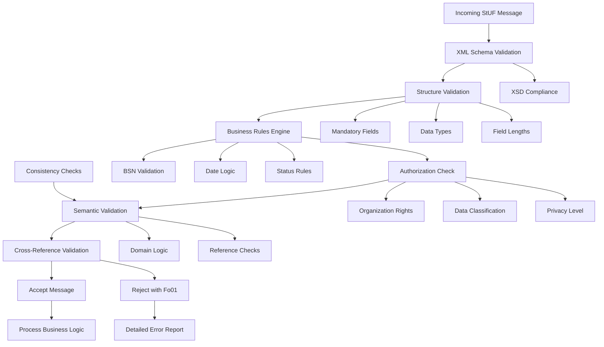

## 6.5 Bedrijfsregels en validaties

Kan bedrijfsregels en validaties definiëren die bij StUF-berichten horen.

### Bedrijfsregels in StUF-context

**Bedrijfsregels** zijn voorschriften die bepalen hoe gegevens in StUF-berichten moeten worden gevalideerd, verwerkt en geïnterpreteerd. Ze borgen de kwaliteit en consistentie van gegevensuitwisseling tussen overheidsapplicaties.

#### Types bedrijfsregels

**1. Structurele validaties**
- XML-schema conformiteit
- Verplichte velden controle
- Datatype-validaties
- Lengte-beperkingen

**2. Semantische validaties**
- BSN-elfproef
- Datum-consistentie
- Referentiële integriteit
- Domain-specific rules

**3. Autorisatie-regels**
- Toegangsrechten per organisatie
- Gegevens-classificatie
- Privacy-beperkingen
- Audit-requirements

**4. Business-logica regels**
- Workflow-validaties
- Status-transities
- Tijdstippen en deadlines
- Cross-system consistency

### Validatie-architectuur



### Implementatie van bedrijfsregels

#### XML Schema-validaties

**BSN-validatie in XSD:**
```xml
<!-- BSN-datatype definitie -->
<xs:simpleType name="BSN">
    <xs:restriction base="xs:string">
        <xs:pattern value="[0-9]{9}"/>
        <xs:length value="9"/>
    </xs:restriction>
</xs:simpleType>

<!-- Datum-validatie -->
<xs:simpleType name="StUF_datum">
    <xs:union>
        <xs:simpleType>
            <xs:restriction base="xs:string">
                <xs:pattern value="[0-9]{8}"/>
                <xs:length value="8"/>
            </xs:restriction>
        </xs:simpleType>
        <xs:simpleType>
            <xs:restriction base="StUF_noValue"/>
        </xs:simpleType>
    </xs:union>
</xs:simpleType>

<!-- Postcode-validatie -->
<xs:simpleType name="Nederlandse_postcode">
    <xs:restriction base="xs:string">
        <xs:pattern value="[1-9][0-9]{3} ?[A-Za-z]{2}"/>
        <xs:minLength value="6"/>
        <xs:maxLength value="7"/>
    </xs:restriction>
</xs:simpleType>
```

#### Java-implementatie bedrijfsregels

**BSN-elfproef validatie:**
```java
@Component
public class StufBusinessRulesValidator {
    
    public ValidationResult validateBSN(String bsn) {
        // Structuur-check
        if (bsn == null || !bsn.matches("\\d{9}")) {
            return ValidationResult.error("StUF071", 
                "BSN moet bestaan uit exacte 9 cijfers");
        }
        
        // Elfproef-algoritme
        int[] weights = {9, 8, 7, 6, 5, 4, 3, 2, 1};
        int sum = 0;
        
        for (int i = 0; i < 9; i++) {
            int digit = Character.getNumericValue(bsn.charAt(i));
            sum += digit * weights[i];
        }
        
        if (sum % 11 != 0 || bsn.startsWith("0")) {
            return ValidationResult.error("StUF071", 
                "BSN voldoet niet aan elfproef-controle");
        }
        
        return ValidationResult.success();
    }
    
    public ValidationResult validateDatum(String datum, String veldNaam) {
        if (datum == null || datum.isEmpty()) {
            return ValidationResult.success(); // Optioneel veld
        }
        
        // Format-check
        if (!datum.matches("\\d{8}")) {
            return ValidationResult.error("StUF072", 
                String.format("%s moet format YYYYMMDD hebben", veldNaam));
        }
        
        // Datum-parsing
        try {
            LocalDate parsed = LocalDate.parse(datum, 
                DateTimeFormatter.ofPattern("yyyyMMdd"));
            
            // Realistische datum-check
            if (parsed.isAfter(LocalDate.now().plusYears(1))) {
                return ValidationResult.warning("StUF073",
                    String.format("%s ligt ver in de toekomst", veldNaam));
            }
            
            if (parsed.isBefore(LocalDate.of(1900, 1, 1))) {
                return ValidationResult.warning("StUF074",
                    String.format("%s ligt ver in het verleden", veldNaam));
            }
            
            return ValidationResult.success();
            
        } catch (DateTimeParseException e) {
            return ValidationResult.error("StUF072",
                String.format("%s bevat ongeldige datum", veldNaam));
        }
    }
    
    public ValidationResult validateAdresConsistentie(
            String postcode, String huisnummer, String woonplaats) {
        
        // Cross-field validatie
        if (StringUtils.isBlank(postcode) && StringUtils.isBlank(woonplaats)) {
            return ValidationResult.error("StUF075",
                "Postcode of woonplaats is verplicht voor adres");
        }
        
        // BAG-validatie (mockup)
        if (StringUtils.isNotBlank(postcode) && StringUtils.isNotBlank(huisnummer)) {
            boolean bagExists = bagService.existsAddress(postcode, huisnummer);
            if (!bagExists) {
                return ValidationResult.warning("StUF076",
                    "Adres niet gevonden in BAG-registratie");
            }
        }
        
        return ValidationResult.success();
    }
}
```

#### Autorisatie-regels

**Role-based access control:**
```java
@Component
public class StufAuthorizationValidator {
    
    public ValidationResult validateMessageAccess(
            StuurGegevens stuurgegevens, String berichtType) {
        
        String organisatie = stuurgegevens.getZender().getOrganisatie();
        String applicatie = stuurgegevens.getZender().getApplicatie();
        String gebruiker = stuurgegevens.getZender().getGebruiker();
        
        // Organisatie-verificatie
        if (!isValidOrganisatie(organisatie)) {
            return ValidationResult.error("StUF013",
                "Onbekende organisatie-code: " + organisatie);
        }
        
        // Applicatie-autorisatie
        Application app = applicationService.getByNameAndOrg(applicatie, organisatie);
        if (app == null || !app.isActive()) {
            return ValidationResult.error("StUF013",
                "Applicatie niet geautoriseerd: " + applicatie);
        }
        
        // Bericht-type autorisatie
        if (!app.hasPermissionForMessageType(berichtType)) {
            return ValidationResult.error("StUF013",
                String.format("Geen autorisatie voor berichttype '%s'", berichtType));
        }
        
        // Gebruiker-verificatie (optioneel)
        if (StringUtils.isNotBlank(gebruiker)) {
            User user = userService.getByUsernameAndOrg(gebruiker, organisatie);
            if (user == null || !user.isActive()) {
                return ValidationResult.warning("StUF013",
                    "Onbekende gebruiker: " + gebruiker);
            }
        }
        
        return ValidationResult.success();
    }
    
    public ValidationResult validateDataAccess(
            String organisatie, String dataElement) {
        
        DataClassification classification = 
            dataClassificationService.getClassification(dataElement);
        
        OrganisationPermission permissions = 
            permissionService.getPermissions(organisatie);
        
        if (classification.getLevel() > permissions.getMaxDataLevel()) {
            return ValidationResult.error("StUF013",
                String.format("Onvoldoende autorisatie voor '%s' (niveau %d)",
                    dataElement, classification.getLevel()));
        }
        
        // Privacy-restricties
        if (classification.isPrivacySensitive() && 
            !permissions.hasPrivacyClearance()) {
            return ValidationResult.error("StUF013",
                String.format("Geen privacy-autorisatie voor '%s'", dataElement));
        }
        
        return ValidationResult.success();
    }
}
```

### Domein-specifieke validaties

#### BRP-specifieke bedrijfsregels

```java
@Component
public class BrpBusinessRulesValidator {
    
    public ValidationResult validatePersonenGegevens(NpsObject persoon) {
        List<ValidationResult> results = new ArrayList<>();
        
        // Geslacht/voornaam consistentie
        results.add(validateGeslachtVoornaamConsistentie(
            persoon.getGeslachtsaanduiding(), 
            persoon.getVoornamen()));
        
        // Leeftijd-afhankelijke validaties
        results.add(validateLeeftijdAfhankelijkeGegevens(persoon));
        
        // Adres-historie consistency
        results.add(validateAdresHistorie(persoon.getAdresGegeven()));
        
        // Burgerlijke staat logic
        results.add(validateBurgerlijkeStaatTransities(
            persoon.getBurgerlijkeStaat()));
        
        return ValidationResult.combine(results);
    }
    
    private ValidationResult validateGeslachtVoornaamConsistentie(
            String geslacht, String voornamen) {
        
        if ("M".equals(geslacht) && voornamen != null) {
            List<String> vrouwelijkeVoornamen = Arrays.asList(
                "Maria", "Anna", "Elisabeth", "Catharina");
            
            for (String vrouwelijkeNaam : vrouwelijkeVoornamen) {
                if (voornamen.contains(vrouwelijkeNaam)) {
                    return ValidationResult.warning("BRP001",
                        String.format("Mogelijke inconsistentie: geslacht %s met voornaam %s",
                            geslacht, vrouwelijkeNaam));
                }
            }
        }
        
        return ValidationResult.success();
    }
    
    private ValidationResult validateLeeftijdAfhankelijkeGegevens(NpsObject persoon) {
        
        LocalDate geboortedatum = parseDatum(persoon.getGeboortedatum());
        if (geboortedatum == null) {
            return ValidationResult.success(); // Cannot validate without birthdate
        }
        
        int leeftijd = Period.between(geboortedatum, LocalDate.now()).getYears();
        
        // Minderjarigen mogen niet getrouwd zijn
        if (leeftijd < 18 && "H".equals(persoon.getBurgerlijkeStaat().getCode())) {
            return ValidationResult.error("BRP002",
                "Persoon onder 18 jaar kan niet getrouwd zijn");
        }
        
        // AOW-leeftijd inconsistenties
        if (leeftijd >= 67 && persoon.hasActiveEmployment()) {
            return ValidationResult.warning("BRP003",
                "Persoon boven AOW-leeftijd heeft actieve dienstbetrekking");
        }
        
        return ValidationResult.success();
    }
}
```

#### ZKN-specifieke bedrijfsregels

```java
@Component  
public class ZknBusinessRulesValidator {
    
    public ValidationResult validateZaakCreatie(ZakObject zaak) {
        List<ValidationResult> results = new ArrayList<>();
        
        // Zaaktype-validaties
        results.add(validateZaaktype(zaak.getZaaktype()));
        
        // Behandelaar-autorisatie
        results.add(validateBehandelaarAutorisatie(
            zaak.getBehandelaar(), zaak.getZaaktype()));
        
        // Termijn-validaties
        results.add(validateBehandelingsTermijn(zaak));
        
        // Vertrouwelijkheid-regels
        results.add(validateVertrouwelijkheidNiveau(zaak));
        
        return ValidationResult.combine(results);
    }
    
    public ValidationResult validateZaakStatusTransitie(
            String huidigeStatus, String nieuweStatus, ZaaktypeObject zaaktype) {
        
        // Haal toegestane transities op uit zaaktype
        List<StatusTransitie> toegestaneTransities = 
            zaaktype.getStatusTransities();
        
        boolean transitieToegstaan = toegestaneTransities.stream()
            .anyMatch(t -> t.getVanStatus().equals(huidigeStatus) && 
                          t.getNaarStatus().equals(nieuweStatus));
        
        if (!transitieToegstaan) {
            return ValidationResult.error("ZKN001",
                String.format("Ongeldige status-transitie van '%s' naar '%s' voor zaaktype '%s'",
                    huidigeStatus, nieuweStatus, zaaktype.getOmschrijving()));
        }
        
        // Tijdstippen valideren
        if (isEindStatus(nieuweStatus) && !allRequiredDocumentsPresent(zaak)) {
            return ValidationResult.error("ZKN002",
                "Cannot close zaak: required documents missing");
        }
        
        return ValidationResult.success();
    }
}
```

### Configureerbare bedrijfsregels

#### Rule-engine integratie

```java
@Component
public class ConfigurableRulesEngine {
    
    @Autowired
    private RuleRepository ruleRepository;
    
    public ValidationResult applyRules(String ruleContext, Object data) {
        List<BusinessRule> rules = ruleRepository.findByContext(ruleContext);
        List<ValidationResult> results = new ArrayList<>();
        
        for (BusinessRule rule : rules) {
            if (rule.isActive()) {
                ValidationResult result = evaluateRule(rule, data);
                results.add(result);
            }
        }
        
        return ValidationResult.combine(results);
    }
    
    private ValidationResult evaluateRule(BusinessRule rule, Object data) {
        try {
            // Gebruik expression-evaluator (bijv. SpEL)
            Boolean ruleResult = expressionEvaluator.evaluate(
                rule.getExpression(), data, Boolean.class);
            
            if (!ruleResult) {
                return ValidationResult.of(
                    rule.getSeverity(),
                    rule.getErrorCode(),
                    rule.getDescription()
                );
            }
            
            return ValidationResult.success();
            
        } catch (Exception e) {
            log.error("Error evaluating rule {}: {}", rule.getId(), e.getMessage());
            return ValidationResult.error("RULE_ENGINE_ERROR",
                "Error during rule evaluation: " + e.getMessage());
        }
    }
}

// Database-entity voor configureerbare regels
@Entity
@Table(name = "business_rules")
public class BusinessRule {
    @Id
    private String id;
    
    @Column(name = "context")
    private String context; // "BRP_PERSON_VALIDATION", "ZKN_ZAAK_CREATION", etc.
    
    @Column(name = "expression")
    private String expression; // SpEL expression
    
    @Column(name = "description")
    private String description;
    
    @Column(name = "error_code")
    private String errorCode;
    
    @Enumerated(EnumType.STRING)
    private RuleSeverity severity; // ERROR, WARNING, INFO
    
    private boolean active;
    
    // getters/setters...
}
```

#### Rule configuratie voorbeelden

```yaml
# business-rules.yml
business_rules:
  brp_person_validation:
    - id: "BRP_BSN_REQUIRED"
      expression: "burgerservicenummer != null && burgerservicenummer.length() == 9"
      severity: "ERROR"
      error_code: "BRP_001"
      description: "BSN is verplicht en moet 9 cijfers bevatten"
      
    - id: "BRP_REALISTIC_AGE"
      expression: "geboortedatum != null && geboortedatum.isAfter(T(java.time.LocalDate).of(1900, 1, 1))"
      severity: "WARNING"  
      error_code: "BRP_002"
      description: "Geboortedatum lijkt onrealistisch"
      
    - id: "BRP_ADULT_MARRIAGE"
      expression: "burgerlijkeStaat?.code != 'H' || calculateAge(geboortedatum) >= 18"
      severity: "ERROR"
      error_code: "BRP_003"
      description: "Minderjarigen kunnen niet getrouwd zijn"
      
  zkn_zaak_validation:
    - id: "ZKN_VALID_INITIATOR"
      expression: "initiator != null && initiator.bsn?.matches('\\\\d{9}')"
      severity: "ERROR"
      error_code: "ZKN_001"
      description: "Zaak-initiator moet geldig persoon zijn"
      
    - id: "ZKN_DEADLINE_FUTURE"
      expression: "streefdatum == null || streefdatum.isAfter(T(java.time.LocalDate).now())"
      severity: "WARNING"
      error_code: "ZKN_002"
      description: "Streefdatum zou in de toekomst moeten liggen"
```

### Error-response generatie

#### GeSystematic error-reporting

```xml
<!-- Enhanced Fo01 met business-rule violations -->
<StUF:Fo01Bericht>
    <StUF:stuurgegevens>
        <StUF:berichtcode>Fo01</StUF:berichtcode>
        <StUF:crossRefnummer>ZAAK-REQ-20240305-001</StUF:crossRefnummer>
        <!-- ... -->
    </StUF:stuurgegevens>
    
    <StUF:body>
        <StUF:code>StUF001</StUF:code>
        <StUF:plek>business-rules-engine.gemeente.nl</StUF:plek>
        <StUF:omschrijving>Business-rule validatie gefaald</StUF:omschrijving>
        
        <!-- Uitgebreide fout-details -->
        <StUF:details>
            <StUF:validationErrors>
                <!-- BSN-validatie fout -->
                <StUF:validationError>
                    <StUF:severity>ERROR</StUF:severity>
                    <StUF:code>BRP_001</StUF:code>
                    <StUF:field>BG:burgerservicenummer</StUF:field>
                    <StUF:value>12345678X</StUF:value>
                    <StUF:description>BSN voldoet niet aan elfproef-controle</StUF:description>
                    <StUF:helpUrl>https://api.gemeente.nl/help/bsn-validatie</StUF:helpUrl>
                </StUF:validationError>
                
                <!-- Datum-inconsistentie -->
                <StUF:validationError>
                    <StUF:severity>WARNING</StUF:severity>
                    <StUF:code>BRP_002</StUF:code>
                    <StUF:field>BG:geboortedatum</StUF:field>
                    <StUF:value>18500315</StUF:value>
                    <StUF:description>Geboortedatum lijkt onrealistisch (voor 1900)</StUF:description>
                    <StUF:suggestion>Controleer datum-invoer</StUF:suggestion>
                </StUF:validationError>
                
                <!-- Autorisatie-probleem -->
                <StUF:validationError>
                    <StUF:severity>ERROR</StUF:severity>
                    <StUF:code>AUTH_003</StUF:code>
                    <StUF:field>BG:burgerlijkeStaat</StUF:field>
                    <StUF:description>Geen autorisatie voor privacygevoelige gegevens</StUF:description>
                    <StUF:requiredPermission>PRIVACY_LEVEL_3</StUF:requiredPermission>
                    <StUF:contactInfo>privacy-officer@gemeente.nl</StUF:contactInfo>
                </StUF:validationError>
            </StUF:validationErrors>
        </StUF:details>
    </StUF:body>
</StUF:Fo01Bericht>
```

Het definiëren van bedrijfsregels en validaties is essentieel voor het waarborgen van data-kwaliteit en consistentie in StUF-communicatie. Door systematische implementatie van regels kunnen organisaties de betrouwbaarheid van gegevensuitwisseling significant verbeteren.

**Resources:**
- [StUF Business Rules Repository](https://www.gemmaonline.nl/)
- [BRP Validatie-regels](https://www.rvig.nl/brp)
- [RSGB Business Rules](https://www.geonovum.nl/geo-standaarden/rsgb)