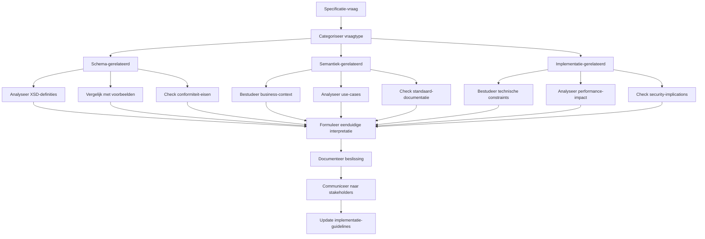
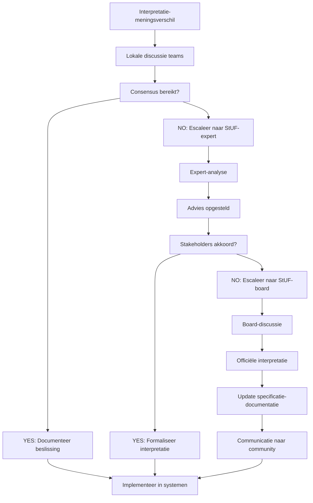

## 6.6 Specificaties verduidelijken

Kan bij vragen of meningsverschillen over de toepassing van StUF specificaties en schema's verduidelijken ten behoeve van eenduidige implementatie.

### Rol van StUF-expert

Als StUF-expert word je regelmatig geconfronteerd met interpretatievragen over specificaties. Deze vragen ontstaan doordat:

- **Specificaties** soms ambigue geformuleerd zijn
- **Implementaties** verschillende interpretaties toestaan
- **Business-context** invloed heeft op technische keuzes
- **Legacy-systemen** afwijkende gedragingen vertonen

#### Veelvoorkomende vraagcategorieën

**1. Schema-interpretaties**
- Verplichte vs optionele velden
- Datatype-beperkingen
- Cardinaliteit-regels
- Namespace-gebruik

**2. Bericht-semantiek**
- Verwerkingssoorten-toepassing
- Tijdlijn-interpretaties
- Cross-references
- NoValue-betekenissen

**3. Implementatie-patronen**
- Exception-handling
- Performance-optimalisaties
- Security-implementatie
- Backwards-compatibility

### Methodiek voor specificatie-verduidelijking

#### Stap 1: Probleem-analyse



#### Stap 2: Research-methodiek

**Bronnen-hiërarchie:**
1. **Officiële StUF-specificaties** (normatief)
2. **W3C XML/SOAP-standaarden** (technische basis)
3. **GEMMA/VNG-documentatie** (interpretatie-hulp)
4. **Referentie-implementaties** (praktijk-voorbeelden)
5. **Community-discussies** (ervaringen delen)

### Veelvoorkomende interpretatie-vraagstukken

#### 1. Verplichte vs optionele velden

**Vraag**: "Is het veld `<BG:voornamen>` verplicht als de persoon geen voornamen heeft?"

**Analyse:**
```xml
<!-- XSD-definitie -->
<xs:element name="voornamen" type="bg:Voornamen" minOccurs="0" maxOccurs="1"/>

<!-- NoValue-mogelijkheden -->
<xs:complexType name="Voornamen">
    <xs:simpleContent>
        <xs:extension base="bg:VoornamenType">
            <xs:attribute ref="StUF:noValue"/>
        </xs:extension>
    </xs:simpleContent>
</xs:complexType>
```

**Interpretatie:**
```xml
<!-- Optie 1: Element weglaten (XSD-conform) -->
<BG:object StUF:entiteittype="NPS">
    <BG:burgerservicenummer>123456789</BG:burgerservicenummer>
    <BG:geslachtsnaam>
        <BG:geslachtsnaam>Berg</BG:geslachtsnaam>
    </BG:geslachtsnaam>
    <!-- voornamen weggelaten -->
</BG:object>

<!-- Optie 2: NoValue gebruiken (expliciet) -->
<BG:object StUF:entiteittype="NPS">
    <BG:burgerservicenummer>123456789</BG:burgerservicenummer>
    <BG:geslachtsnaam>
        <BG:geslachtsnaam>Berg</BG:geslachtsnaam>
    </BG:geslachtsnaam>
    <BG:voornamen StUF:noValue="geenWaarde"/>
</BG:object>
```

**Aanbeveling:**
> *Gebruik **optie 2** (expliciet noValue) voor duidelijkheid richting consumer. Dit voorkomt verwarring over of het veld per ongeluk vergeten is of daadwerkelijk geen waarde heeft.*

#### 2. Verwerkingssoorten-interpretatie

**Vraag**: "Wanneer gebruik je `StUF:verwerkingssoort="W"` vs `StUF:verwerkingssoort="T"`?"

**Scenario**: Person already exists, but new address is added.

```xml
<!-- Variant 1: Wijziging van bestaande persoon (W) -->
<BG:object StUF:entiteittype="NPS" StUF:verwerkingssoort="W">
    <BG:burgerservicenummer>123456789</BG:burgerservicenummer>
    <BG:adresAanduidingGegeven StUF:verwerkingssoort="T">
        <!-- Nieuw adres wordt toegevoegd -->
        <BG:woonplaatsWoongebied>Utrecht</BG:woonplaatsWoongebied>
        <BG:straatnaam>Domstraat</BG:straatnaam>
        <BG:huisnummer>15</BG:huisnummer>
        <BG:tijdvakGeldigheid>
            <StUF:beginGeldigheid>20240305000000</StUF:beginGeldigheid>
        </BG:tijdvakGeldigheid>
    </BG:adresAanduidingGegeven>
</BG:object>

<!-- Variant 2: Persoon-object identificatie (I) met adres-toevoeging (T) -->  
<BG:object StUF:entiteittype="NPS" StUF:verwerkingssoort="I">
    <BG:burgerservicenummer>123456789</BG:burgerservicenummer>
    <BG:adresAanduidingGegeven StUF:verwerkingssoort="T">
        <!-- Nieuw adres -->
        <!-- ... -->
    </BG:adresAanduidingGegeven>
</BG:object>
```

**Interpretatie-richtlijn:**
- **"W" op hoofdobject**: Als eigenschappen van het object zelf wijzigen
- **"I" op hoofdobject**: Als het object alleen geïdentificeerd wordt voor gerelateerde wijzigingen
- **"T" op sub-element**: Als nieuwe gegevens worden toegevoegd
- **"W" op sub-element**: Als bestaande gegevens wijzigen

#### 3. Tijdlijn-complexiteit

**Vraag**: "Hoe werk je met formele vs materiële historie in StUF?"

**Scenario**: Person moved address on Jan 1st, but municipality only registered it on Jan 15th.

```xml
<BG:object StUF:entiteittype="NPS">
    <BG:burgerservicenummer>123456789</BG:burgerservicenummer>
    
    <!-- Oude adres wordt beëindigd -->
    <BG:adresAanduidingGegeven StUF:verwerkingssoort="W">
        <BG:straatnaam>Oude Gracht</BG:straatnaam>
        <BG:huisnummer>100</BG:huisnummer>
        
        <!-- Materiële tijdlijn: wanneer was het geldig? -->
        <BG:tijdvakGeldigheid>
            <StUF:beginGeldigheid>20230101000000</StUF:beginGeldigheid>
            <StUF:eindGeldigheid>20231231235959</StUF:eindGeldigheid>  <!-- Verhuizing op 1 jan -->
        </BG:tijdvakGeldigheid>
        
        <!-- Formele tijdlijn: wanneer geregistreerd? -->
        <BG:tijdstipRegistratie>20230201120000</BG:tijdstipRegistratie>  <!-- Later geregistreerd -->
        <BG:eindRegistratie>20240115143000</BG:eindRegistratie>          <!-- Correctie-moment -->
    </BG:adresAanduidingGegeven>
    
    <!-- Nieuwe adres -->
    <BG:adresAanduidingGegeven StUF:verwerkingssoort="T">
        <BG:straatnaam>Nieuwe Gracht</BG:straatnaam>
        <BG:huisnummer>200</BG:huisnummer>
        
        <!-- Materiële tijdlijn: geldig vanaf verhuisdatum -->
        <BG:tijdvakGeldigheid>
            <StUF:beginGeldigheid>20240101000000</StUF:beginGeldigheid>
            <StUF:eindGeldigheid StUF:noValue="geenWaarde"/>
        </BG:tijdvakGeldigheid>
        
        <!-- Formele tijdlijn: registratie-moment -->
        <BG:tijdstipRegistratie>20240115143000</BG:tijdstipRegistratie>
        <BG:eindRegistratie StUF:noValue="geenWaarde"/>
    </BG:adresAanduidingGegeven>
</BG:object>
```

**Interpretatie-principes:**
- **TijdvakGeldigheid**: Wanneer was iets waar in de werkelijkheid?
- **TijdstipRegistratie**: Wanneer kwam het in het systeem?
- **Correcties**: Leiden tot nieuwe formele tijdstempels, materiële tijden blijven

#### 4. Cross-reference-semantiek

**Vraag**: "Wanneer gebruik je `StUF:crossRefnummer` en wanneer `StUF:referentienummer`?"

**Pattern-analyse:**
```xml
<!-- Request-bericht -->
<StUF:Lv01Bericht>
    <StUF:stuurgegevens>
        <StUF:referentienummer>REQUEST-001</StUF:referentienummer>  <!-- Uniek voor deze message -->
        <!-- geen crossRefnummer in request -->
    </StUF:stuurgegevens>
</StUF:Lv01Bericht>

<!-- Response-bericht -->
<StUF:La01Bericht>
    <StUF:stuurgegevens>
        <StUF:referentienummer>RESPONSE-001</StUF:referentienummer>  <!-- Uniek voor deze response -->
        <StUF:crossRefnummer>REQUEST-001</StUF:crossRefnummer>       <!-- Verwijst naar request -->
    </StUF:stuurgegevens>
</StUF:La01Bericht>

<!-- Error-bericht -->
<StUF:Fo01Bericht>
    <StUF:stuurgegevens>
        <StUF:referentienummer>ERROR-001</StUF:referentienummer>     <!-- Uniek voor deze error -->
        <StUF:crossRefnummer>REQUEST-001</StUF:crossRefnummer>       <!-- Verwijst naar foutieve request -->
    </StUF:stuurgegevens>
</StUF:Fo01Bericht>
```

**Regel**: *Elk bericht heeft eigen `referentienummer`. Alleen response/error-berichten gebruiken `crossRefnummer` om naar het oorspronkelijke request te verwijzen.*

### Communicatie-strategieën

#### Stakeholder-gerichte communicatie

**Voor Developers:**
```markdown
## Technische Clarificatie: NoValue-interpretatie

**Vraag**: Hoe om te gaan met lege velden in StUF-berichten?

**Korte antwer**: Gebruik `StUF:noValue` attributes om expliciet aan te geven waarom een veld leeg is.

**Code-voorbeeld**:
```xml
<BG:geboortedatum StUF:noValue="nietGeautoriseerd"/>  <!-- Geen toegang -->
<BG:overlijdensdatum StUF:noValue="geenWaarde"/>      <!-- Persoon leeft nog -->
<BG:nationaliteit StUF:noValue="vastgesteldOnbekend"/>  <!-- Onbekend in registratie -->
```

**Impact**: Consumer kan onderscheid maken tussen "vergeten meesturen" en "bewust leeg".
```

**Voor Business-analisten:**
```markdown
## Business-regel Clarificatie: BSN-validatie

**Situatie**: Zaaksysteem weigert BSN "000000000"

**Oorzaak**: StUF-specificatie vereist geldige BSN volgens elfproef-algoritme.

**Business-impact**: 
- BSN "000000000" is test-BSN, niet geldig voor productie
- Gebruik BSN's uit officiële test-set voor development/testing
- Productie-BSN's moeten altijd elfproef passeren

**Actie**: Update test-data met geldige test-BSN's
```

**Voor Managers:**
```markdown
## Interpretation-beslissing: StUF-versie migratie

**Context**: Meerdere systemen interpreteren StUF 3.00 anders dan StUF 3.01

**Beslissing**: Standaardiseren op StUF 3.01 voor alle nieuwe integraties

**Rationale**:
- StUF 3.01 heeft duidelijkere specificaties
- Betere tooling-ondersteuning
- Bredere industry-adoptie

**Timeline**: 12 maanden voor volledige migratie
**Impact**: Temporary dual-support nodig tijdens transition
```

### Documentatie van beslissingen

#### Decision-record template

```yaml
title: "StUF-BG Adres-historie interpretatie"
date: "2024-03-05"
status: "ACCEPTED"  # PROPOSED, REJECTED, SUPERSEDED

context: |
  Onduidelijkheid over hoe adres-historie gecommuniceerd moet worden
  in StUF-BG berichten. Verschillende leveranciers implementeren het
  verschillend.

decision: |  
  Adres-wijzigingen worden gecommuniceerd als:
  1. Bestaand adres krijgt StUF:verwerkingssoort="W" met eindGeldigheid
  2. Nieuw adres krijgt StUF:verwerkingssoort="T" met beginGeldigheid
  3. Overlap in geldigheidsperioden is toegestaan voor complex-changes

  Niet als: volledige vervanging van alle adres-gegevens

rationale: |
  - Behoudt historie-informatie
  - Minder data-transport needed
  - Consistent met BRP-registratie-semantiek
  - Backwards-compatible met bestaande implementaties

consequences: |
  Positief:
  - Efficiënte historie-overdracht
  - Consistent met domein-logica
  
  Negatief:  
  - Complex voor consumers om te parsen
  - Vereist historie-aware processing

examples:
  - file: "adres-wijziging-voorbeeld.xml"
    description: "Person moves from Amsterdam to Utrecht"
  - file: "adres-correctie-voorbeeld.xml" 
    description: "Correction of existing address data"

references:
  - "StUF-BG 3.10 Specificatie, sectie 4.2.1"
  - "RSGB 3.0 Historie-model"
  - "VNG-discussie thread #2847"

approved_by: "StUF-expertgroep"
implemented_by: ["Team-A", "Team-B"]
review_date: "2024-09-01"
```

### Conflictoplossing

#### Escalatie-proces



#### Multi-stakeholder alignment

**Stakeholder-matrix:**
- **Leveranciers**: Implementatie-feasibility  
- **Gemeenten**: Business-requirements
- **VNG**: Standaardisatie-aspecten
- **Experts**: Technische-correctheid

**Alignment-workshop format:**
1. **Probleem-presentatie** (15 min)
2. **Stakeholder-standpunten** (30 min)  
3. **Technische analyse** (20 min)
4. **Consensus-building** (45 min)
5. **Besluit en documentatie** (20 min)

Het vermogen om StUF-specificaties helder te interpreteren en te communiceren is essentieel voor succesvolle implementatie van gegevensuitwisseling in de overheid. Door systematische analyse en eenduidige communicatie kunnen implementatie-verschillen worden voorkomen en interoperabiliteit gewaarborgd.

**Resources:**
- [StUF Interpretatie-forum](https://www.gemmaonline.nl/index.php/StUF)
- [VNG-expertgroep StUF](https://vng-realisatie.github.io/StUF-Standaarden/)
- [StUF FAQ's en Voorbeelden](https://www.stuftest.nl/)