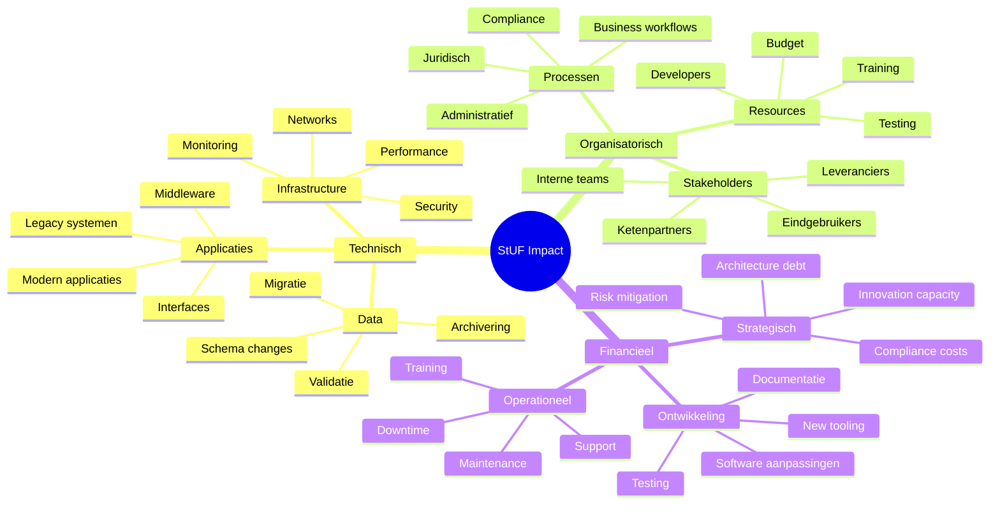
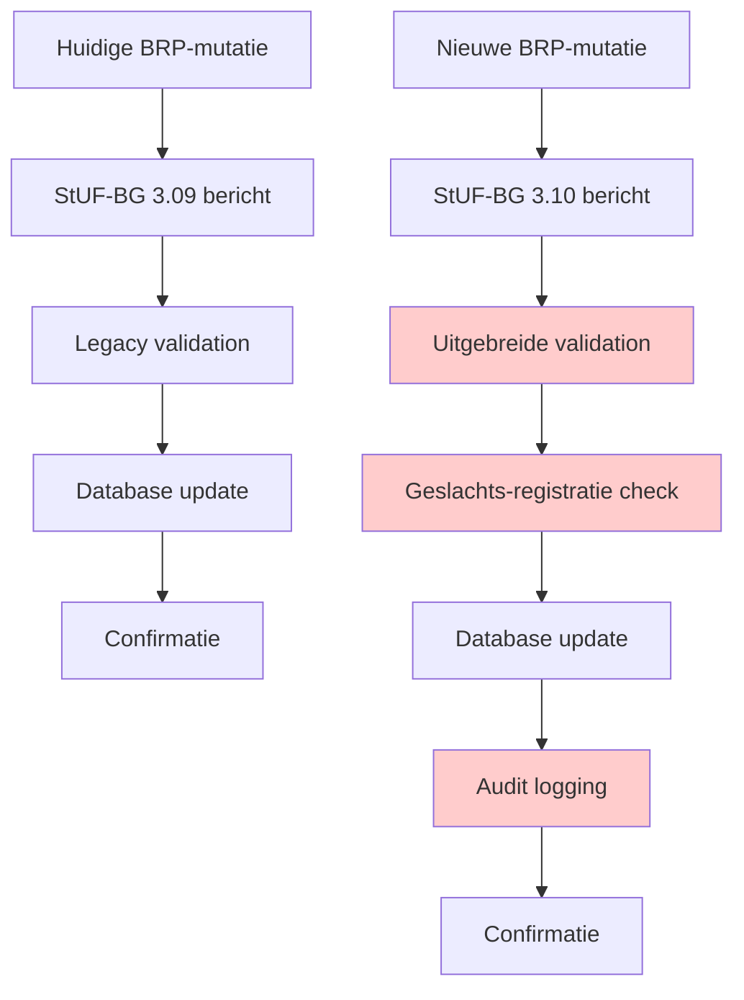
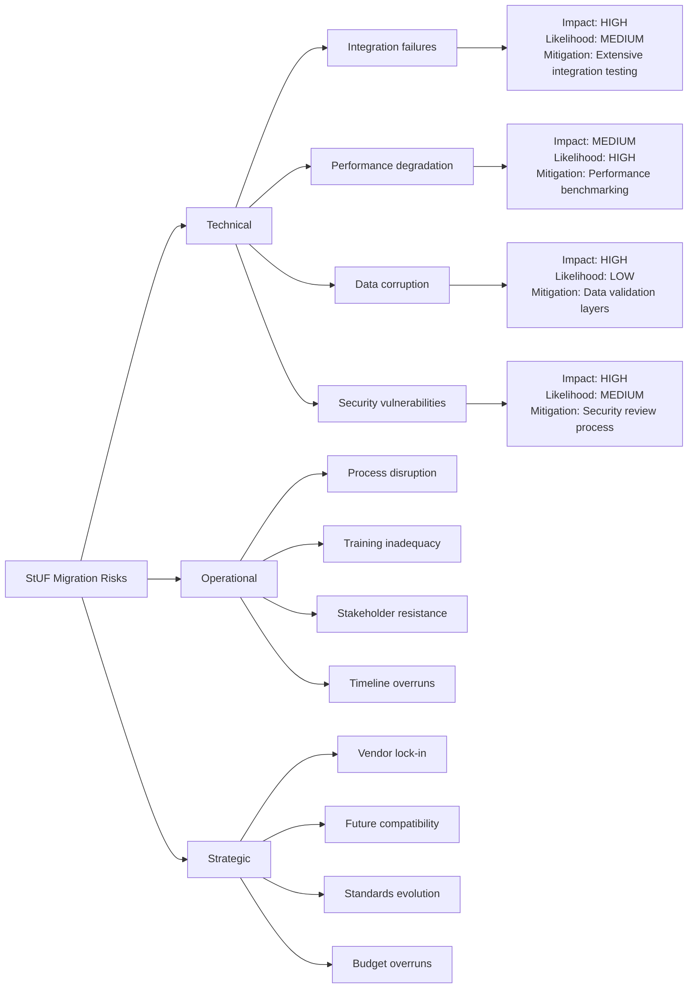
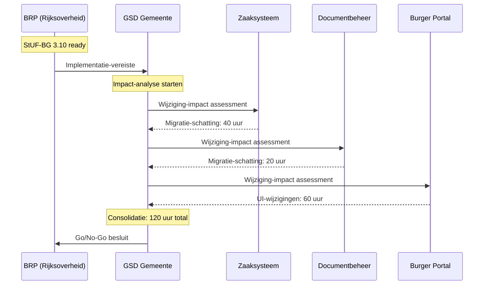

## 6.7 Impactanalyses uitvoeren

Kan de technische en organisatorische impact van wijzigingen in StUF-standaarden analyseren, zowel voor eigen organisatie als voor ketenpartners.

### Impact-analyse framework

De impact van StUF-wijzigingen strekt zich uit over meerdere dimensies:



### Technische impact-analyse

#### 1. Applicatie-niveau impact

**Schema-wijzigingen analyseren:**

```xml
<!-- Voor-situatie: StUF-BG 3.09 -->
<BG:object StUF:entiteittype="NPS">
    <BG:burgerservicenummer>123456789</BG:burgerservicenummer>
    <BG:voornamen>Jan</BG:voornamen>
    <BG:geslachtsnaam>
        <BG:geslachtsnaam>Jansen</BG:geslachtsnaam>
    </BG:geslachtsnaam>
    <BG:geslachtsaanduiding>M</BG:geslachtsaanduiding>
</BG:object>

<!-- Na-situatie: StUF-BG 3.10 met uitgebreid geslachtsmodel -->
<BG:object StUF:entiteittype="NPS">
    <BG:burgerservicenummer>123456789</BG:burgerservicenummer>
    <BG:voornamen>Jan</BG:voornamen>
    <BG:geslachtsnaam>
        <BG:geslachtsnaam>Jansen</BG:geslachtsnaam>
    </BG:geslachtsnaam>
    <!-- NIEUW: Uitgebreid geslachtsmodel -->
    <BG:geslachtsaanduiding>M</BG:geslachtsaanduiding>
    <BG:geslachtsregistratie>
        <BG:officieleGeslachtsaanduiding>M</BG:officieleGeslachtsaanduiding>
        <BG:geslachtswijzigingsDatum StUF:noValue="geenWaarde"/>
        <BG:juridischeProcedureVereist>false</BG:juridischeProcedureVereist>
    </BG:geslachtsregistratie>
</BG:object>
```

**Impact-assessment matrix:**

| Component | Wijziging | Impact | Effort | Risk |
|-----------|-----------|--------|--------|------|
| Consumer-applicaties | Parse nieuwe geslachtsregistratie | Medium | 8 uur/systeem | Low |
| Producer-applicaties | Genereer uitgebreide gegevens | High | 40 uur/systeem | Medium |
| Database-schema | Nieuwe tabellen/kolommen | Medium | 16 uur | Low |  
| Business-logica | Update validatie-regels | High | 24 uur | High |
| User-interface | Toon nieuwe velden | Medium | 20 uur | Low |
| Rapportages | Update query's/reports | Low | 8 uur | Low |

#### 2. Interface-niveau impact

**Backwards-compatibility analyseren:**

```java
// Oude parser (pre-3.10)
public class StufPersonParser {
    public Person parsePerson(Element npsElement) {
        Person person = new Person();
        person.setBSN(getElementText(npsElement, "burgerservicenummer"));
        person.setVoornamen(getElementText(npsElement, "voornamen"));
        
        // Simpele geslachts-mapping
        String geslacht = getElementText(npsElement, "geslachtsaanduiding");
        person.setGeslacht(Geslacht.valueOf(geslacht));
        
        return person;
    }
}

// Nieuwe parser (3.10-compatible) - BACKWARDS COMPATIBLE!
public class StufPersonParserV310 {
    public Person parsePerson(Element npsElement) {
        Person person = new Person();
        person.setBSN(getElementText(npsElement, "burgerservicenummer"));
        person.setVoornamen(getElementText(npsElement, "voornamen"));
        
        // Backwards compatibility: oude veld blijft werken
        String basicGeslacht = getElementText(npsElement, "geslachtsaanduiding");
        person.setGeslacht(Geslacht.valueOf(basicGeslacht));
        
        // Nieuwe functionaliteit: uitgebreid geslachtsmodel
        Element geslachtsReg = getChildElement(npsElement, "geslachtsregistratie");
        if (geslachtsReg != null) {
            GeslachtsRegistratie reg = parseGeslachtsRegistratie(geslachtsReg);
            person.setGeslachtsRegistratie(reg);  // Optioneel - systeem werkt zonder 
        }
        
        return person;
    }
    
    private GeslachtsRegistratie parseGeslachtsRegistratie(Element element) {
        // Nieuwe parsing-logica voor uitgebreid model  
        GeslachtsRegistratie reg = new GeslachtsRegistratie();
        reg.setOfficieleAanduiding(getElementText(element, "officieleGeslachtsaanduiding"));
        
        String wijzigingsDatum = getElementText(element, "geslachtswijzigingsDatum");
        if (!"geenWaarde".equals(getNoValueAttribute(element.querySelector("geslachtswijzigingsDatum")))) {
            reg.setWijzigingsDatum(parseDate(wijzigingsDatum));
        }
        
        return reg;
    }
}
```

**Compatibility-strategy:**
- **Phase 1**: Deploy backwards-compatible parsers
- **Phase 2**: Gradually enable new functionality  
- **Phase 3**: Deprecate old patterns (2+ years later)

#### 3. Performance-impact analyse

**Message-size impact:**
```python
# Script om bericht-grootte impact te meten
def analyze_message_size_impact():
    """Analyseer grootte-verschil tussen oude en nieuwe berichten"""
    
    # Simuleer berichten met verschillende complexiteit
    test_cases = [
        {"name": "Simple person", "relations": 0, "addresses": 1},
        {"name": "Complex person", "relations": 3, "addresses": 2}, 
        {"name": "Large family", "relations": 8, "addresses": 1}
    ]
    
    for case in test_cases:
        # Genereer oude en nieuwe berichten
        old_message = generate_stuf_309_message(**case)
        new_message = generate_stuf_310_message(**case)
        
        old_size = len(old_message.encode('utf-8'))
        new_size = len(new_message.encode('utf-8'))
        increase = ((new_size - old_size) / old_size) * 100
        
        print(f"{case['name']}")
        print(f"  Old: {old_size:,} bytes")
        print(f"  New: {new_size:,} bytes")
        print(f"  Increase: {increase:.1f}%")
        print()

# Verwachte output:
# Simple person
#   Old: 2,847 bytes  
#   New: 3,234 bytes
#   Increase: 13.6%
#
# Complex person  
#   Old: 8,932 bytes
#   New: 10,148 bytes
#   Increase: 13.6%
```

**Performance benchmarks:**
```yaml
# Performance impact StUF 3.09 → 3.10
parsing_performance:
  old_version: "145ms avg voor 100 personen"
  new_version: "162ms avg voor 100 personen"  
  impact: "+11.7% processing time"
  
network_performance:
  old_version: "2.3MB avg dataset"
  new_version: "2.6MB avg dataset" 
  impact: "+13% bandwidth usage"
  
storage_performance:
  old_version: "4.2GB indexed StUF messages/maand"
  new_version: "4.8GB indexed StUF messages/maand"
  impact: "+14% storage requirements"
```

### Organisatorische impact-analyse  

#### 1. Proces-impact

**Workflow-veranderingen:**



**Nieuwe validatie-stappen:**
1. **Geslachts-consistentie**: Officiele vs. administratieve aanduiding
2. **Juridische procedures**: Verplichte documenten voor wijzigingen
3. **Audit-trail**: Uitgebreide logging voor geslachts-wijzigingen
4. **Privacy-compliance**: GDPR compliance voor gevoelige data

#### 2. Stakeholder-impact mapping

**Impact per stakeholder-groep:**

| Stakeholder | Huidige situatie | Nieuwe situatie | Wijzigings-impact |
|-------------|------------------|------------------|-------------------|
| **Burger-zaken medewerkers** | Simpele geslachts-registratie | Uitgebreid model met juridische procedures | **Training nodig** op nieuwe workflows (16 uur) |
| **IT-developers** | Basic StUF parsing/generation | Complex geslachts-registratie logic | **Ontwikkeling** nieuwe components (120 uur) |
| **Business-analysts** | Eenvoudige business rules | Complexe privacyregels en audit requirements | **Proces-herontwerp** (80 uur) |
| **Test-engineers** | Basic happy-path testing | Uitgebreid edge-case testing | **Test-suite uitbreiding** (60 uur) |
| **Compliance-officers** | Standard GDPR monitoring | Intensieve monitoring geslachts-data | **Compliance-procedure aanpassing** (40 uur) |

#### 3. Communicatie-strategie

**Multi-channel communicatie-plan:**

```yaml
communication_phases:
  phase_1_announcement:
    duration: "Maand -6 voor go-live"
    channels: ["Email", "Intranet", "Team meetings"]
    audience: ["Alle stakeholders"]
    content: "Introductie wijziging, timeline, high-level impact"
    
  phase_2_training:
    duration: "Maand -3 tot -1"  
    channels: ["Workshops", "E-learning", "Documentation"]
    audience: ["Direct betrokkenen"]
    content: "Detailed training, hands-on practice"
    
  phase_3_support:
    duration: "Maand -1 tot +3"
    channels: ["Helpdesk", "Expert-support", "FAQ"]  
    audience: ["Alle gebruikers"]
    content: "Just-in-time ondersteuning, troubleshooting"
    
  phase_4_evaluation:  
    duration: "Maand +1 tot +6"
    channels: ["Surveys", "Interviews", "Metrics"]
    audience: ["Key-stakeholders"]  
    content: "Impact-evaluatie, lessons learned"
```

### Financiele impact-analyse

#### 1. Kosten-categorieën

**Eenmalige implementatie-kosten:**

```python
class StufMigrationCostCalculator:
    def __init__(self):
        # Uurlonen (gemiddeld)
        self.developer_rate = 75  # EUR per uur
        self.analyst_rate = 85    # EUR per uur  
        self.tester_rate = 65     # EUR per uur
        self.trainer_rate = 95    # EUR per uur
        
        # Systeem-complexiteit factors
        self.system_complexity = {
            'simple': 1.0,    # Legacy systems, few integrations
            'medium': 1.5,    # Modern systems, moderate integrations  
            'complex': 2.5    # Core systems, many integrations
        }
    
    def calculate_system_costs(self, system_type, num_systems):
        """Bereken kosten per systeem-type"""
        base_costs = {
            'development': 120 * self.developer_rate,      # 120 uur development
            'analysis': 40 * self.analyst_rate,            # 40 uur analysis
            'testing': 80 * self.tester_rate,              # 80 uur testing
            'documentation': 16 * self.analyst_rate        # 16 uur documentatie
        }
        
        complexity_factor = self.system_complexity[system_type]
        total_base = sum(base_costs.values())
        
        return {
            'per_system': total_base * complexity_factor,
            'total_systems': total_base * complexity_factor * num_systems,
            'breakdown': {k: v * complexity_factor for k, v in base_costs.items()}
        }
    
    def calculate_training_costs(self, stakeholders):
        """Bereken training-kosten"""
        training_costs = {
            'developers': stakeholders['developers'] * 16 * self.developer_rate,
            'analysts': stakeholders['analysts'] * 12 * self.analyst_rate, 
            'testers': stakeholders['testers'] * 8 * self.tester_rate,
            'end_users': stakeholders['end_users'] * 4 * 35,  # 4 uur × €35/uur internal rate
            'trainer_time': 60 * self.trainer_rate  # 60 uur trainer-tijd
        }
        
        return training_costs
    
    def calculate_total_migration_cost(self):
        """Volledige migratie-kosten voor typische gemeente"""
        
        # System inventory (typische gemeente)
        systems = {
            'simple': 5,    # Kleine applicaties  
            'medium': 8,    # Standaard business-apps
            'complex': 3    # Core-systemen (GBA, DMS, etc.)
        }
        
        # Stakeholder-aantallen
        stakeholders = {
            'developers': 12,
            'analysts': 6,
            'testers': 4, 
            'end_users': 45
        }
        
        total_costs = {}
        
        # System-wijziging kosten
        total_costs['systems'] = 0
        for sys_type, count in systems.items():
            costs = self.calculate_system_costs(sys_type, count)
            total_costs[f'systems_{sys_type}'] = costs['total_systems'] 
            total_costs['systems'] += costs['total_systems']
        
        # Training-kosten
        training_costs = self.calculate_training_costs(stakeholders)
        total_costs['training'] = sum(training_costs.values())
        total_costs['training_breakdown'] = training_costs
        
        # Project management & overhead (15%)
        total_costs['project_mgmt'] = (total_costs['systems'] + total_costs['training']) * 0.15
        
        # Risk buffer (10%)
        subtotal = total_costs['systems'] + total_costs['training'] + total_costs['project_mgmt']
        total_costs['risk_buffer'] = subtotal * 0.10
        
        total_costs['grand_total'] = subtotal + total_costs['risk_buffer']
        
        return total_costs

# Example usage
calculator = StufMigrationCostCalculator()
costs = calculator.calculate_total_migration_cost()

print(f"Totale migratie-kosten: €{costs['grand_total']:,.0f}")
print(f"  - Systeem-wijzigingen: €{costs['systems']:,.0f}")  
print(f"  - Training: €{costs['training']:,.0f}")
print(f"  - Project management: €{costs['project_mgmt']:,.0f}")
print(f"  - Risk buffer: €{costs['risk_buffer']:,.0f}")

# Verwachte output:
# Totale migratie-kosten: €387,475
#   - Systeem-wijzigingen: €267,600
#   - Training: €64,380  
#   - Project management: €49,797
#   - Risk buffer: €54,698
```

#### 2. Langetermijn operationele kosten

**Jaarlijkse extra kosten:**
```yaml
operational_costs_annual:
  expanded_message_processing:
    description: "13% meer processing door complexere berichten"
    cpu_costs: "€2,400/jaar additional server capacity"
    storage_costs: "€1,200/jaar additional storage"
    
  enhanced_monitoring:
    description: "Uitgebreide audit-logging voor geslachts-wijzigingen" 
    monitoring_tools: "€3,600/jaar extra monitoring capacity"
    manual_review: "€8,400/jaar (40 uur/maand @ €70/uur)"
    
  compliance_overhead:
    description: "Extra GDPR compliance voor sensitieve geslachts-data"
    legal_review: "€4,800/jaar"
    compliance_audits: "€2,400/jaar"
    
  total_annual: "€22,800/jaar"
```

### Risk-impact analyse

#### 1. Technische risico's



#### 2. Risico-mitigatie strategieën

**High-impact risico's addresseren:**

```java
// Risico: Data corruption tijdens geslachts-migratie
@Component
public class GeslachtMigrationValidator {
    
    public ValidationResult validateGeslachtConsistency(StufMessage message) {
        ValidationResult result = new ValidationResult();
        
        // Regel 1: Basic geslacht moet consistent zijn met uitgebreid model  
        String basicGeslacht = message.getGeslachtsaanduiding();
        String officieleGeslacht = message.getGeslachtsregistratie()?.getOfficieleAanduiding();
        
        if (officieleGeslacht != null && !basicGeslacht.equals(officieleGeslacht)) {
            // CRITICAL: Inconsistentie gedetecteerd
            result.addError("GESLACHT_INCONSISTENT", 
                "Basic geslacht (%s) wijkt af van officiële registratie (%s)", 
                basicGeslacht, officieleGeslacht);
        }
        
        // Regel 2: Geslachts-wijzigingen vereisen juridische documentatie
        GeslachtsRegistratie reg = message.getGeslachtsregistratie();
        if (reg?.getWijzigingsDatum() != null && reg.getJuridischeProcedure() == null) {
            result.addError("JURIDISCHE_PROCEDURE_ONTBREEKT",
                "Geslachts-wijziging zonder juridische procedure-documentatie");
        }
        
        // Regel 3: Privacy-validatie voor gevoelige data
        if (containsSensitiveGenderData(message) && !hasPrivacyConsent(message)) {
            result.addWarning("PRIVACY_CONSENT_ONTBREEKT", 
                "Gevoelige geslachts-informatie zonder expliciete toestemming");
        }
        
        return result;
    }
}
```

### Ketenpartner impact-analyse

#### 1. Upstream/downstream dependencies

**Impact-propagatie door keten:**



#### 2. Vendor-impact coordinatie

**Leverancier-communicatie template:**

```yaml
vendor_communication_template:
  subject: "StUF-BG 3.10 Impact Assessment Required"
  
  background: |
    Het Rijk heeft StUF-BG 3.10 aangekondigd met uitgebreid geslachts-
    registratie model. Implementatie verplicht per [datum].
    
  vendor_requests:
    impact_assessment:
      deadline: "+6 weeks"
      deliverables:
        - "Technical impact analysis"
        - "Migration effort estimation" 
        - "Testing approach"
        - "Timeline proposal"
        - "Cost estimation"
    
    development_planning:
      deadline: "+8 weeks"  
      deliverables:
        - "Development roadmap"
        - "Release planning"
        - "Backwards compatibility strategy"
        - "Support model during transition"
        
  coordination_meetings:
    initial_briefing: "+2 weeks"
    progress_review: "+6 weeks"  
    final_planning: "+10 weeks"
    
  decision_criteria:
    cost_threshold: "€15,000 maximum per system"
    timeline_constraint: "Implementation by [mandatory date]"
    quality_requirements: "Zero data-loss, minimal downtime"
    compliance_requirements: "Full GDPR compliance"
```

### Impact-rapportage

#### Executive summary template

```markdown
# StUF-BG 3.10 Migration Impact Analysis

## Executive Summary

**Decision Required**: Approve €387k investment for StUF-BG 3.10 migration

**Business Driver**: Mandatory government standard update - no alternative

**Key Impacts**:
- 16 applications require modification (simple to complex)  
- 67 staff members need training (4-16 hours each)
- 3-month implementation timeline
- €23k annual ongoing costs

**Recommendations**:
1. **Approve full migration** - regulatory compliance mandatory
2. **Phased implementation** - reduce risk, maintain operations  
3. **Vendor coordination** - ensure all suppliers align
4. **Change management** - intensive stakeholder support

## Impact Summary by Category

| Category | One-time Cost | Annual Cost | Risk Level | Staff Impact |
|----------|---------------|-------------|------------|--------------|
| Technical | €267,600 | €6,000 | Medium | 16 developers |
| Training | €64,380 | €0 | Low | 67 staff |
| Compliance | €0 | €7,200 | High | 6 staff |
| Operations | €0 | €9,600 | Medium | All users |
| **Total** | **€331,980** | **€22,800** | **Medium-High** | **All staff** |

## Timeline and Milestones

- **Month 1-2**: Vendor alignment, detailed planning
- **Month 3-4**: Development and testing  
- **Month 5**: Training and deployment preparation
- **Month 6**: Phased go-live 
- **Month 7-9**: Support and optimization

## Risk Mitigation

**Top 3 Risks**:
1. **Integration failures** → Extensive testing protocol
2. **Staff adaptation** → Comprehensive training program  
3. **Vendor delays** → Contractual commitments with penalties

## Next Steps

1. Secure budget approval (€387k total)
2. Initiate vendor coordination meetings  
3. Form project steering committee
4. Develop detailed project charter

*Prepared by: IT-Architecture team*  
*Review date: [Date]*
*Approval required by: [Date]*
```

Door systematische impact-analyse kunnen organisaties de gevolgen van StUF-wijzigingen accuraat inschatten en weloverwogen implementatie-beslissingen nemen. De combinatie van technische, organisatorische en financiële analyses geeft een compleet beeld van de vereiste investering en risico's.

**Resources:**
- [VNG Impact-assessment toolkit](https://vng-realisatie.github.io/impact-assessment/)
- [StUF Migration Playbook](https://www.gemmaonline.nl/index.php/StUF_Migration)
- [Government Change-management guidelines](https://www.digitaleoverheid.nl/change-management/)