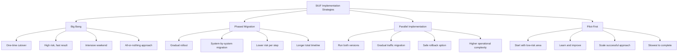
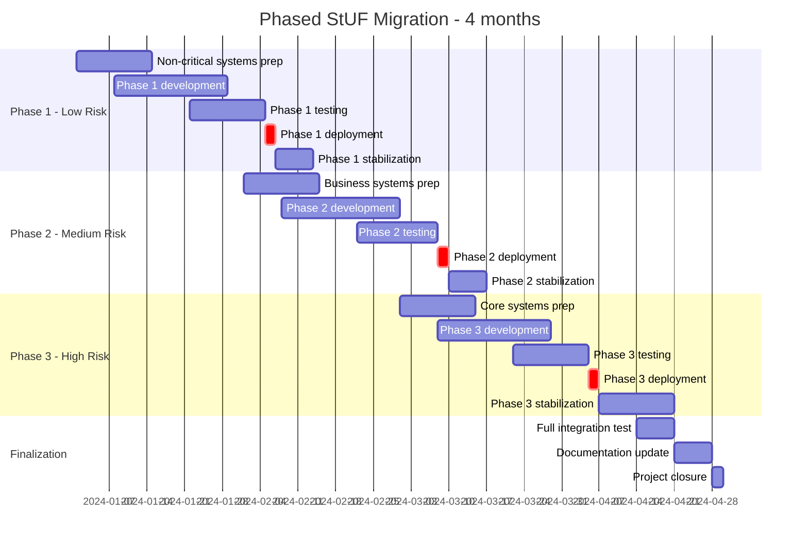
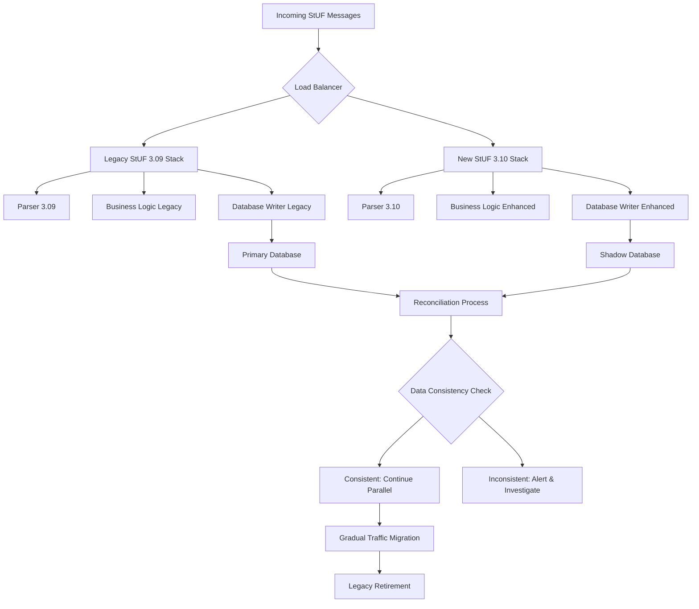
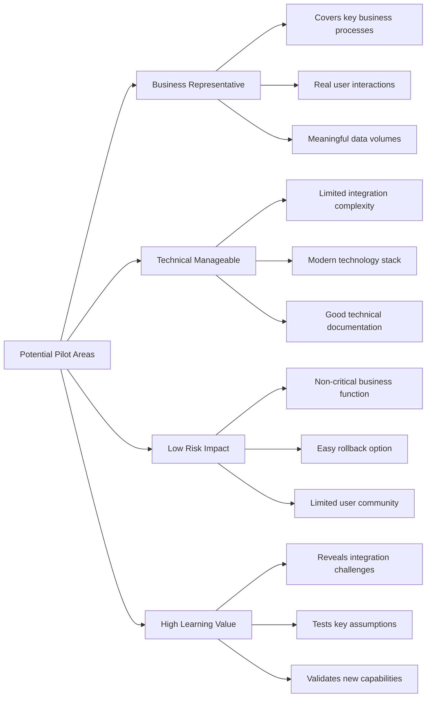
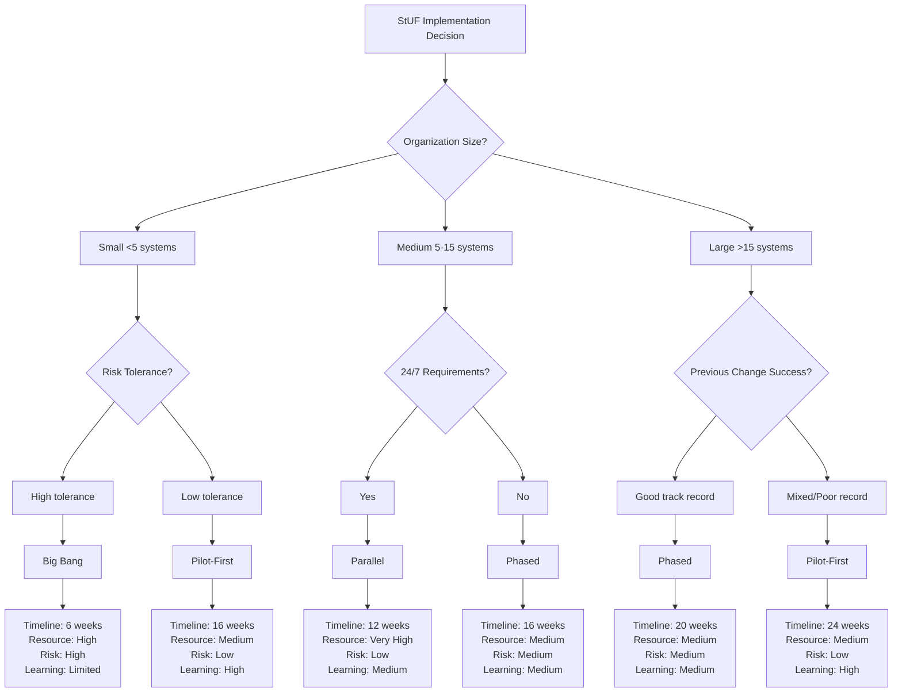

## 6.8 Implementatie-scenario's opstellen

Kan verschillende implementatie-strategieën voor StUF-migraties ontwikkelen, afgestemd op organisatie-eisen, technische constraints en risicotolerantie.

### Implementatie-strategieën overzicht

De keuze van implementatie-strategie bepaalt het succes van StUF-migraties. Elke strategie heeft eigen voor- en nadelen:



### Scenario 1: Big Bang Implementation

#### Geschikt voor:
- **Kleine organisaties** (1-3 kern-systemen)
- **Hoge samenhang** tussen systemen  
- **Beperkte legacy-complexity**
- **Sterke project-management** capaciteit
- **Korte maintenance-windows** beschikbaar

#### Implementatie-planning

**Timeline: 6 weken intensieven**

```mermaid
gantt
    title Big Bang StUF Migration - 6 weeks
    dateFormat  X
    axisFormat %w

    section Preparation
    Requirements analysis    :done, req, 0, 5
    System inventory        :done, inv, 0, 3
    Impact assessment       :done, imp, 3, 7
    
    section Development  
    Code modifications      :dev, 7, 21
    Unit testing           :test, 14, 28
    Integration development :int, 21, 35
    
    section Testing
    System testing         :sys, 28, 42
    User acceptance testing :uat, 35, 42
    Performance testing    :perf, 35, 42
    
    section Deployment
    Pre-deployment prep    :prep, 35, 42
    Go-live weekend       :crit, golive, 42, 43
    Post-deployment support :support, 42, 49
```



**Go-live weekend detailed schedule:**

```yaml
big_bang_weekend_schedule:
  friday_evening:
    "17:00": "Final backup all systems"
    "18:00": "Freeze production changes"  
    "19:00": "Deploy new StUF components"
    "20:00": "Database schema updates"
    "21:00": "Configuration changes"
    "22:00": "Smoke tests" 
    "23:00": "Go/No-go decision point 1"
    
  saturday_morning:
    "06:00": "Full system start-up"
    "07:00": "Integration testing chain"
    "08:00": "End-to-end test scenarios"
    "09:00": "Performance validation"
    "10:00": "User interface testing"
    "11:00": "Go/No-go decision point 2"
    
  saturday_afternoon:  
    "12:00": "Production data migration"
    "14:00": "Final system validation"
    "15:00": "Staff training refresher"
    "16:00": "Soft-open for power users"
    "17:00": "Final sign-off"
    "18:00": "Open for business"
    
  contingency:
    rollback_triggers:
      - "Integration test failures > 5%"
      - "Performance degradation > 25%"  
      - "Data corruption detected"
      - "Critical business process failure"
    rollback_duration: "4 hours to previous state"
    rollback_team: "On-site 24/7 during weekend"
```

**Risk-mitigatie:**
```java
// Big Bang rollback automation
@Component  
public class BigBangRollbackManager {
    
    @Value("${rollback.timeout.minutes:240}")  // 4 hours
    private int rollbackTimeoutMinutes;
    
    public RollbackResult executeEmergencyRollback(RollbackTrigger trigger) {
        logger.critical("Emergency rollback triggered: {}", trigger.getReason());
        
        // Step 1: Stop all processing immediately
        systemManager.stopAllProcessing();
        
        // Step 2: Restore database from pre-migration backup
        DatabaseRestoreResult dbResult = databaseManager.restoreFromBackup(
            "pre-migration-snapshot", 
            Duration.ofMinutes(90)
        );
        
        if (!dbResult.isSuccessful()) {
            logger.error("Database rollback failed: {}", dbResult.getError());
            return RollbackResult.failure("Database restore failed");
        }
        
        // Step 3: Deploy previous application versions
        DeploymentResult deployResult = deploymentManager.deployPreviousVersion();
        
        if (!deployResult.isSuccessful()) {
            logger.error("Application rollback failed: {}", deployResult.getError());  
            return RollbackResult.failure("Application deployment failed");
        }
        
        // Step 4: Validate system health
        HealthCheckResult healthCheck = performExtensiveHealthCheck();
        
        if (healthCheck.isHealthy()) {
            logger.info("Big Bang rollback completed successfully in {}min", 
                Duration.between(trigger.getTimestamp(), Instant.now()).toMinutes());
            return RollbackResult.success();
        } else {
            logger.error("System unhealthy after rollback: {}", healthCheck.getIssues());
            return RollbackResult.failure("Post-rollback health check failed");
        }
    }
    
    private HealthCheckResult performExtensiveHealthCheck() {
        // Test critical business processes
        return healthCheckManager.runFullSuite(Arrays.asList(
            "basisregistratie-connectivity",
            "zaaksysteem-integration", 
            "document-management",
            "citizen-portal-functionality",
            "staff-interface-responsiveness"
        ));
    }
}
```

### Scenario 2: Phased Migration

#### Geschikt voor:
- **Middelgrote tot grote organisaties**
- **Complex applicatie-landschap** 
- **Risk-averse cultuur**
- **Beperkte maintenance-windows**
- **Verschillende business-criticality** per systeem

#### Phase-by-phase planning

**Timeline: 4 maanden gefaseerd**



**System-categorisatie:**
```python
class SystemCategorizationEngine:
    
    def categorize_systems_for_migration(self, systems: List[System]) -> Dict[str, List[System]]:
        """Categoriseer systemen op basis van risico en impact"""
        
        phases = {
            'phase_1_low_risk': [],
            'phase_2_medium_risk': [], 
            'phase_3_high_risk': []
        }
        
        for system in systems:
            risk_score = self._calculate_risk_score(system)
            
            if risk_score <= 3:
                phases['phase_1_low_risk'].append(system)
            elif risk_score <= 6:
                phases['phase_2_medium_risk'].append(system)  
            else:
                phases['phase_3_high_risk'].append(system)
        
        return phases
    
    def _calculate_risk_score(self, system: System) -> int:
        """Bereken risico-score (1-10) op basis van meerdere factoren"""
        score = 0
        
        # Business criticality (0-3 points)
        if system.business_criticality == 'CRITICAL':
            score += 3
        elif system.business_criticality == 'IMPORTANT':
            score += 2
        elif system.business_criticality == 'MEDIUM':
            score += 1
            
        # Technical complexity (0-2 points)
        if system.integration_complexity == 'HIGH':
            score += 2
        elif system.integration_complexity == 'MEDIUM':  
            score += 1
        
        # Legacy factor (0-2 points) 
        if system.age_years > 10:
            score += 2
        elif system.age_years > 5:
            score += 1
            
        # User impact (0-2 points)
        if system.active_users > 100:
            score += 2  
        elif system.active_users > 25:
            score += 1
            
        # StUF-dependency depth (0-1 point)
        if len(system.stuf_integrations) > 5:
            score += 1
            
        return min(score, 10)  # Cap at 10

# Example usage
categorizer = SystemCategorizationEngine()

systems = [
    System("GBA-Systeem", business_criticality='CRITICAL', integration_complexity='HIGH', 
           age_years=12, active_users=150, stuf_integrations=8),
    System("Zaaksysteem", business_criticality='CRITICAL', integration_complexity='MEDIUM',
           age_years=3, active_users=80, stuf_integrations=6), 
    System("Documentbeheer", business_criticality='IMPORTANT', integration_complexity='LOW',
           age_years=2, active_users=45, stuf_integrations=2),
    System("Rapport-generator", business_criticality='MEDIUM', integration_complexity='LOW',
           age_years=8, active_users=12, stuf_integrations=1)
]

phases = categorizer.categorize_systems_for_migration(systems)

# Output:
# Phase 1 (Low Risk): ["Rapport-generator"]  
# Phase 2 (Medium Risk): ["Documentbeheer"] 
# Phase 3 (High Risk): ["GBA-Systeem", "Zaaksysteem"]
```

**Inter-phase dependency management:**
```yaml
phase_dependencies:
  phase_1_completion_criteria:
    - "All low-risk systems successfully migrated"
    - "No critical incidents for 7 days"  
    - "User satisfaction > 80%"
    - "Performance within 5% of baseline"
    - "Full rollback procedure validated"
    
  phase_2_prerequisites:
    - "Phase 1 stable for 14 days"
    - "Lessons learned incorporated"
    - "Team confidence high"
    - "Infrastructure capacity validated"
    
  phase_3_prerequisites:  
    - "Phase 2 stable for 14 days"
    - "All integration scenarios tested"
    - "Emergency procedures validated" 
    - "Full stakeholder sign-off"
    - "Extended support team on-standby"
```

### Scenario 3: Parallel Implementation

#### Geschikt voor:
- **Mission-critical environments**
- **24/7 availability requirements**
- **High data-integrity demands**
- **Substantial infrastructure** capacity
- **Regulatory compliance** obligations

#### Parallel-processing architecture



**Traffic migration schedule:**
```python
class ParallelTrafficController:
    
    def __init__(self):
        self.traffic_split = {
            'legacy': 100,  # Start: 100% legacy 
            'new': 0        # Start: 0% new
        }
        
    def execute_gradual_migration(self):
        """Execute 8-week gradual traffic migration"""
        
        migration_schedule = [
            {'week': 1, 'legacy': 90, 'new': 10},   # Dip toe in water
            {'week': 2, 'legacy': 80, 'new': 20},   # Validate basic functionality
            {'week': 3, 'legacy': 70, 'new': 30},   # Increase load
            {'week': 4, 'legacy': 50, 'new': 50},   # Equal split - major milestone
            {'week': 5, 'legacy': 30, 'new': 70},   # New system takes majority  
            {'week': 6, 'legacy': 15, 'new': 85},   # Reduce legacy significantly
            {'week': 7, 'legacy': 5, 'new': 95},    # Final validation phase
            {'week': 8, 'legacy': 0, 'new': 100}    # Complete migration
        ]
        
        for week_config in migration_schedule:
            self._apply_traffic_split(week_config)
            self._monitor_for_week(week_config['week'])
            
            if not self._week_successful():
                logger.warning(f"Week {week_config['week']} issues detected")
                self._rollback_traffic()
                break
    
    def _apply_traffic_split(self, config):
        """Update load balancer configuration"""
        load_balancer_config = {
            'upstream_legacy': {
                'weight': config['legacy'],
                'servers': ['legacy-1:8080', 'legacy-2:8080']
            },
            'upstream_new': {
                'weight': config['new'], 
                'servers': ['new-1:8080', 'new-2:8080']
            }
        }
        
        self.load_balancer.update_config(load_balancer_config)
        logger.info(f"Traffic split updated: Legacy {config['legacy']}%, New {config['new']}%")
    
    def _monitor_for_week(self, week_number):
        """Monitor system health during traffic split"""
        
        metrics_to_monitor = [
            'error_rate_legacy', 'error_rate_new',
            'response_time_legacy', 'response_time_new', 
            'data_consistency_score',
            'user_satisfaction_score'
        ]
        
        daily_reports = []
        for day in range(7):
            daily_metrics = self.metrics_collector.collect_daily_metrics(metrics_to_monitor)
            daily_reports.append(daily_metrics)
            
            # Critical thresholds
            if daily_metrics['error_rate_new'] > daily_metrics['error_rate_legacy'] * 1.5:
                self.alerts.trigger_alert("NEW_SYSTEM_ERROR_RATE_HIGH")
                
            if daily_metrics['data_consistency_score'] < 0.99:
                self.alerts.trigger_alert("DATA_CONSISTENCY_LOW")
        
        return daily_reports
    
    def _week_successful(self) -> bool:
        """Evaluate if week was successful based on metrics"""
        
        week_metrics = self.metrics_analyzer.analyze_week_performance()
        
        success_criteria = {
            'error_rate_increase': lambda x: x < 0.1,      # <10% error increase
            'performance_degradation': lambda x: x < 0.15,  # <15% performance degradation  
            'data_consistency': lambda x: x > 0.995,       # >99.5% consistency
            'user_satisfaction': lambda x: x > 0.85        # >85% satisfaction
        }
        
        for criterion, threshold_func in success_criteria.items():
            if not threshold_func(week_metrics[criterion]):
                logger.error(f"Week failed on criterion: {criterion} = {week_metrics[criterion]}")
                return False
                
        return True
```

### Scenario 4: Pilot-First Implementation

#### Geschikt voor:
- **Onzekere migratie-complexity**
- **Learning-oriented cultuur**
- **Multiple similar organizations** (gemeenten)  
- **Innovation-budget** beschikbaar
- **Low pressure delivery-timeline**

#### Pilot-selection criteria



**Pilot-project planning:**

```yaml
pilot_project_structure:
  phase_1_pilot_selection:
    duration: "2 weeks"
    activities:
      - "Evaluate candidate business areas"
      - "Assess technical feasibility" 
      - "Engage stakeholder commitment"
      - "Define success criteria"
    deliverable: "Pilot project charter"
    
  phase_2_pilot_development:
    duration: "6 weeks"
    activities:
      - "Implement StUF 3.10 for pilot area"
      - "Build comprehensive test scenarios"
      - "Create monitoring dashboards"
      - "Develop user training materials"
    deliverable: "Pilot-ready system"
    
  phase_3_pilot_execution:
    duration: "4 weeks"  
    activities:
      - "Deploy pilot to limited user group"
      - "Monitor system behavior closely"
      - "Collect user feedback systematically"
      - "Document issues and solutions"
    deliverable: "Pilot evaluation report"
    
  phase_4_lessons_integration:
    duration: "2 weeks"
    activities:
      - "Analyze pilot results"
      - "Update implementation approach"
      - "Refine estimates and timelines" 
      - "Plan organization-wide rollout"
    deliverable: "Refined implementation strategy"
```

**Learning-capture framework:**

```python
class PilotLearningCapture:
    
    def __init__(self):
        self.learning_categories = [
            'technical_challenges',
            'user_adoption_patterns', 
            'performance_characteristics',
            'integration_complexities',
            'operational_procedures'
        ]
    
    def capture_daily_learnings(self, day_number: int):
        """Systematische dagelijkse learning-capture"""
        
        learning_entry = {
            'day': day_number,
            'timestamp': datetime.now().isoformat(),
            'learnings': {}
        }
        
        for category in self.learning_categories:
            category_learnings = self._capture_category_learnings(category)
            learning_entry['learnings'][category] = category_learnings
        
        # Store for analysis
        self.learning_database.store(learning_entry)
        
        # Real-time alerts for critical learnings
        self._evaluate_critical_learnings(learning_entry)
        
        return learning_entry
    
    def _capture_category_learnings(self, category: str) -> List[Dict]:
        """Capture learnings voor specifieke categorie"""
        
        if category == 'technical_challenges':
            return self._capture_technical_learnings()
        elif category == 'user_adoption_patterns':
            return self._capture_user_learnings()  
        elif category == 'performance_characteristics':
            return self._capture_performance_learnings()
        elif category == 'integration_complexities':
            return self._capture_integration_learnings() 
        elif category == 'operational_procedures':
            return self._capture_operational_learnings()
        
    def _capture_technical_learnings(self) -> List[Dict]:
        """Technische learnings van vandaag"""
        
        learnings = []
        
        # Automatisch: parsing-errors analyseren  
        parsing_errors = self.log_analyzer.extract_parsing_errors(today=True)
        if parsing_errors:
            learnings.append({
                'type': 'parsing_challenge',
                'description': f"Parsing errors detected in {len(parsing_errors)} message types",
                'details': parsing_errors,
                'impact': 'medium',
                'solution_needed': True
            })
        
        # Automatisch: performance-afwijkingen
        performance_metrics = self.performance_monitor.get_today_anomalies()
        if performance_metrics:
            learnings.append({
                'type': 'performance_anomaly', 
                'description': f"Performance deviations in {len(performance_metrics)} areas",
                'details': performance_metrics,
                'impact': 'high' if any(m['degradation'] > 0.3 for m in performance_metrics) else 'medium',
                'solution_needed': True
            })
        
        # Handmatig: team-observaties toevoegen via interface
        manual_observations = self.learning_interface.get_manual_technical_observations()
        learnings.extend(manual_observations)
        
        return learnings
    
    def generate_pilot_final_report(self) -> Dict:
        """Consolideer alle learnings tot final report"""
        
        all_learnings = self.learning_database.get_all()
        
        report = {
            'executive_summary': self._generate_executive_summary(all_learnings),
            'technical_insights': self._analyze_technical_patterns(all_learnings),
            'user_experience_findings': self._analyze_user_patterns(all_learnings),
            'operational_recommendations': self._generate_operational_recommendations(all_learnings),
            'scaling_considerations': self._generate_scaling_advice(all_learnings),
            'implementation_adjustments': self._recommend_implementation_changes(all_learnings)
        }
        
        return report
```

### Scenario-evaluatie matrix

Voor de keuze tussen implementatie-scenario's:

| Criterium | Big Bang | Phased | Parallel | Pilot-First |
|-----------|----------|--------|----------|-------------|
| **Project Duration** | ⭐⭐⭐ Fast | ⭐⭐ Medium | ⭐⭐ Medium | ⭐ Slow |
| **Risk Level** | ⭐ High | ⭐⭐ Medium | ⭐⭐⭐ Low | ⭐⭐⭐ Low |
| **Resource Intensity** | ⭐⭐⭐ High | ⭐⭐ Medium | ⭐ Very High | ⭐⭐ Medium |
| **Learning Opportunity** | ⭐ Limited | ⭐⭐ Some | ⭐⭐ Some | ⭐⭐⭐ Extensive |
| **Rollback Complexity** | ⭐ Hard | ⭐⭐ Medium | ⭐⭐⭐ Easy | ⭐⭐⭐ Easy |
| **Business Disruption** | ⭐ High | ⭐⭐ Medium | ⭐⭐⭐ Minimal | ⭐⭐⭐ Minimal |

### Implementatie-beslisboom



### Hybrid-scenario ontwikkeling

**Combinatie-strategieën:**
- **Pilot-Phased**: Start met pilot, dan gefaseerd uitrollen
- **Parallel-Big Bang**: Parallel validation, dan snelle cutover
- **Phased-Big Bang**: Fasen voor development, big bang per fase

```python
class HybridImplementationPlanner:
    
    def design_hybrid_strategy(self, organization_profile: Dict) -> Dict:
        """Ontwerp hybride strategie op basis van organisatie-profiel"""
        
        # Analyseer organisatie-karakteristieken
        risk_level = self._assess_risk_tolerance(organization_profile)
        technical_capability = self._assess_technical_capability(organization_profile) 
        business_criticality = self._assess_business_criticality(organization_profile)
        
        # Selecteer primaire en secundaire strategieën
        if risk_level == 'LOW' and technical_capability == 'HIGH':
            return self._design_pilot_phased_strategy(organization_profile)
        elif business_criticality == 'CRITICAL' and technical_capability == 'HIGH':
            return self._design_parallel_bigbang_strategy(organization_profile)
        else:
            return self._design_standard_phased_strategy(organization_profile)
    
    def _design_pilot_phased_strategy(self, profile: Dict) -> Dict:
        """Pilot-first gevolgd door phased rollout"""  
        
        return {
            'name': 'Pilot-Phased Hybrid',
            'phases': [
                {
                    'name': 'Pilot Phase',
                    'duration_weeks': 8,
                    'scope': 'Single low-risk department',
                    'strategy': 'pilot_first',
                    'success_criteria': ['90% user satisfaction', 'Zero critical incidents', '99%+ data integrity']
                },
                {
                    'name': 'Phase 1 - Similar Departments', 
                    'duration_weeks': 6,
                    'scope': 'Departments similar to pilot',
                    'strategy': 'phased_migration',
                    'success_criteria': ['Pilot lessons applied', 'Smooth rollout', 'Staff confidence high']
                },
                {
                    'name': 'Phase 2 - Core Systems',
                    'duration_weeks': 8, 
                    'scope': 'Business-critical systems',
                    'strategy': 'phased_migration',
                    'success_criteria': ['Zero business disruption', 'Performance maintained', 'Compliance validated']
                },
                {
                    'name': 'Phase 3 - Finalization', 
                    'duration_weeks': 4,
                    'scope': 'Integration completion',
                    'strategy': 'big_bang_finalization',
                    'success_criteria': ['End-to-end validation', 'Legacy retirement', 'Full documentation']
                }
            ],
            'total_duration_weeks': 26,
            'risk_profile': 'Low-Medium',
            'learning_opportunities': 'High'
        }
```

De keuze van implementatie-scenario bepaalt grotendeels het succes van StUF-migraties. Door systematische evaluatie van organisatie-karakteristieken en projeto-eisen kan de optimale strategie geselecteerd worden, vaak in hybride vorm die de voordelen van meerdere benaderingen combineert.

**Resources:**
- [StUF Implementation Patterns](https://www.gemmaonline.nl/index.php/StUF_Implementation)
- [VNG Migration Strategies Guide](https://vng-realisatie.github.io/migration-strategies/)  
- [Government Change-management Playbook](https://www.digitaleoverheid.nl/change-management-playbook/)