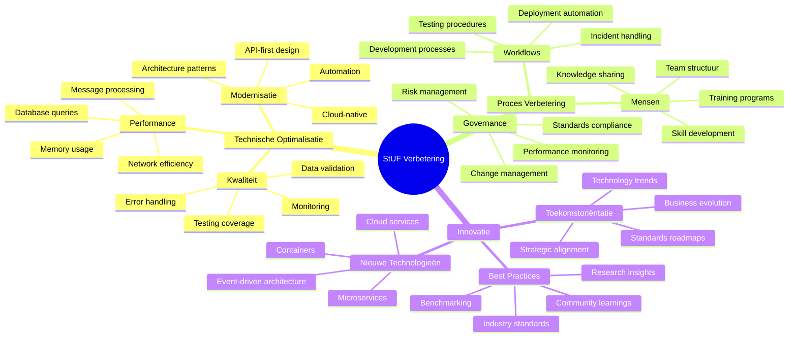
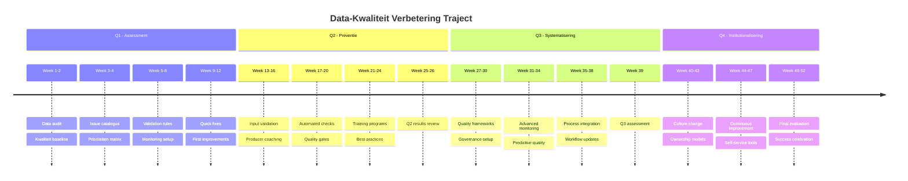
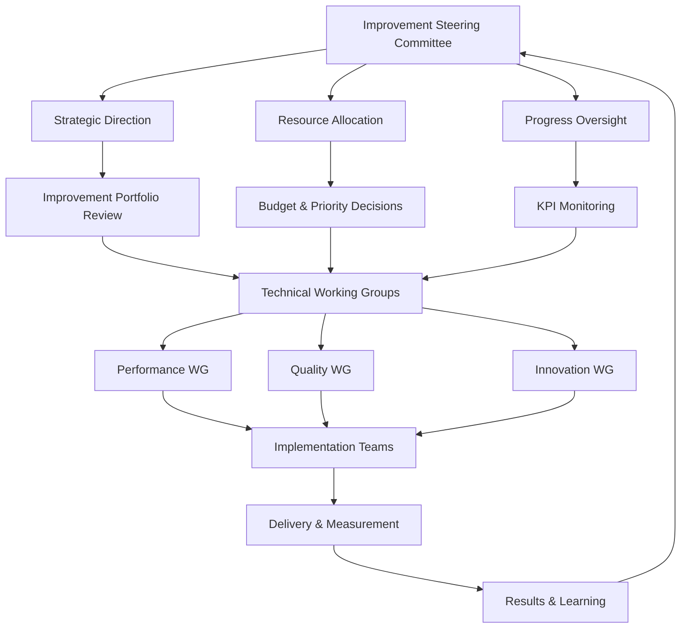

## 6.9 Verbetertrajecten initiëren

Kan continue-verbeteringsinitiatieven voor StUF-implementaties opzetten, monitoren en sturen om de kwaliteit en efficiëntie van gegevensuitwisseling structureel te verhogen.

### Continue verbetering-framework

StUF-verbetertrajecten vereisen systematische aanpak die technische optimalisatie combineert met proces-verbetering:



### Verbetering-identificatie systematiek

#### 1. Performance-monitoring dashboard

```python
class StufPerformanceAnalyzer:
    
    def __init__(self):
        self.metrics_collector = MetricsCollector()
        self.trend_analyzer = TrendAnalyzer()
        self.bottleneck_detector = BottleneckDetector()
        
    def generate_improvement_opportunities(self) -> List[ImprovementOpportunity]:
        """Identificeer verbeter-mogelijkheden op basis van metrics"""
        
        opportunities = []
        
        # 1. Performance-bottlenecks
        performance_issues = self._analyze_performance_bottlenecks()
        opportunities.extend(performance_issues)
        
        # 2. Error-pattern analysis  
        error_patterns = self._analyze_error_patterns()
        opportunities.extend(error_patterns)
        
        # 3. Capacity-planning issues
        capacity_issues = self._analyze_capacity_trends()
        opportunities.extend(capacity_issues)
        
        # 4. Integration-efficiency
        integration_issues = self._analyze_integration_efficiency()
        opportunities.extend(integration_issues)
        
        # Prioriteer op basis van impact en effort
        prioritized_opportunities = self._prioritize_opportunities(opportunities)
        
        return prioritized_opportunities
    
    def _analyze_performance_bottlenecks(self) -> List[ImprovementOpportunity]:
        """Detecteer performance-bottlenecks in StUF-processing"""
        
        opportunities = []
        
        # Message parsing performance
        parsing_metrics = self.metrics_collector.get_parsing_performance()
        if parsing_metrics['avg_parse_time'] > 500:  # > 500ms gemiddeld
            opportunities.append(ImprovementOpportunity(
                type='performance',
                area='message_parsing',
                description=f'Message parsing trager dan acceptabel: {parsing_metrics["avg_parse_time"]}ms gemiddeld',
                current_value=parsing_metrics['avg_parse_time'],
                target_value=250,  # Target: 250ms
                impact='HIGH',
                effort='MEDIUM',
                solutions=[
                    'XML parsing optimalisatie',
                    'Streaming parser implementatie', 
                    'Message caching strategie',
                    'Parser performance profiling'
                ]
            ))
        
        # Database query performance
        db_metrics = self.metrics_collector.get_database_performance()
        slow_queries = [q for q in db_metrics['queries'] if q['avg_duration'] > 1000]
        if slow_queries:
            opportunities.append(ImprovementOpportunity(
                type='performance',
                area='database_queries',
                description=f'{len(slow_queries)} database queries zijn langzaam (>1s)',
                current_value=len(slow_queries),
                target_value=0,
                impact='HIGH', 
                effort='MEDIUM',
                solutions=[
                    'Query optimalisatie',
                    'Index toevoeging/aanpassing',
                    'Database partitioning', 
                    'Query result caching'
                ]
            ))
        
        # Memory usage patterns
        memory_metrics = self.metrics_collector.get_memory_usage()
        if memory_metrics['memory_growth_trend'] > 0.1:  # >10% growth per week
            opportunities.append(ImprovementOpportunity(
                type='performance',
                area='memory_usage',
                description=f'Memory gebruik groeit {memory_metrics["memory_growth_trend"]*100:.1f}% per week',
                current_value=memory_metrics['memory_growth_trend'],
                target_value=0.02,  # Target: <2% growth per week
                impact='MEDIUM',
                effort='HIGH',
                solutions=[
                    'Memory leak detection',
                    'Garbage collection tuning', 
                    'Object pooling implementatie',
                    'Message size optimalisatie'
                ]
            ))
        
        return opportunities
        
    def _analyze_error_patterns(self) -> List[ImprovementOpportunity]:
        """Analyseer error-patronen voor verbetering-mogelijkheden"""
        
        opportunities = []
        
        # Frequent error types
        error_analysis = self.metrics_collector.get_error_analysis()
        
        for error_type, stats in error_analysis['frequent_errors'].items():
            if stats['frequency'] > 10 and stats['trend'] == 'INCREASING':  # >10/day en stijgend
                opportunities.append(ImprovementOpportunity(
                    type='quality',
                    area='error_reduction',
                    description=f'Frequent error type: {error_type} ({stats["frequency"]}/day, stijgend)',
                    current_value=stats['frequency'],
                    target_value=max(1, stats['frequency'] * 0.2),  # 80% reductie
                    impact='MEDIUM',
                    effort='MEDIUM', 
                    solutions=[
                        f'Root cause analysis voor {error_type}',  
                        'Input validation verbetering',
                        'Error handling robustheid',
                        'Producer system verbetering'
                    ]
                ))
        
        return opportunities

@dataclass
class ImprovementOpportunity:
    type: str  # 'performance', 'quality', 'maintainability', 'scalability'
    area: str
    description: str
    current_value: float
    target_value: float  
    impact: str  # 'LOW', 'MEDIUM', 'HIGH'
    effort: str  # 'LOW', 'MEDIUM', 'HIGH'
    solutions: List[str]
    
    @property
    def priority_score(self) -> float:
        """Bereken prioriteit-score (impact/effort)"""
        impact_values = {'LOW': 1, 'MEDIUM': 2, 'HIGH': 3}
        effort_values = {'LOW': 1, 'MEDIUM': 2, 'HIGH': 3}
        
        return impact_values[self.impact] / effort_values[self.effort]
```

#### 2. Stakeholder-feedback systematiek

```yaml
feedback_collection_framework:
  stakeholder_groups:
    developers:
      collection_method: "Monthly technical surveys"
      key_questions:
        - "Welke StUF-development aspecten kosten meeste tijd?"
        - "Welke tools/libraries missen in huidige stack?"
        - "Waar ervaar je meeste frustratie in StUF-werk?"  
        - "Welke verbetering zou grootste impact hebben?"
      feedback_channels: ["survey", "retrospectives", "1-on-1s"]
      
    operations:  
      collection_method: "Bi-weekly operational reviews"
      key_questions:
        - "Welke incidents komen meest voor?"
        - "Waar is monitoring/alerting ontoereikend?"
        - "Welke maintenance-taken zijn meest tijdrovend?"
        - "Welke automation-mogelijkheden zie je?"
      feedback_channels: ["incident-reviews", "operations-meetings", "issue-tracking"]
      
    business_users:
      collection_method: "Quarterly user experience sessions"  
      key_questions:
        - "Welke data-uitwisseling processen lopen niet soepel?"
        - "Waar ervaar je vertragingen in informatieverwerkking?"
        - "Welke functionaliteit ontbreekt voor jouw werk?"
        - "Welke verbetering zou jouw dagelijkse werk helpen?"  
      feedback_channels: ["workshops", "user-interviews", "support-tickets"]
```

### Verbetering-projecten opzetten

#### 1. Project-portfolio management

```mermaid
graph TD  
    A[Improvement Opportunities] --> B[Impact-Effort Analysis]
    B --> C[Project Portfolio Formation]
    
    C --> D[Quick Wins<br/>High Impact, Low Effort]
    C --> E[Major Projects<br/>High Impact, High Effort] 
    C --> F[Fill-ins<br/>Low Impact, Low Effort]
    C --> G[Questionable<br/>Low Impact, High Effort]
    
    D --> H[Immediate Implementation<br/>Sprint-based work]
    E --> I[Dedicated Project Teams<br/>Quarter-based planning]
    F --> J[Background Tasks<br/>Slack time utilization]
    G --> K[Defer/Reject<br/>Resource focus]
    
    H --> L[Monthly Review Cycle]
    I --> L  
    J --> L
    L --> M[Portfolio Adjustment]
    M --> N[Continuous Improvement]
```



**Portfolio-planning template:**
```python
class ImprovementPortfolioManager:
    
    def create_improvement_portfolio(self, opportunities: List[ImprovementOpportunity], 
                                   resources: ResourceConstraints) -> ImprovementPortfolio:
        """Maak verbeter-portfolio op basis van mogelijkheden en resources"""
        
        # Categoriseer opportunities
        categorized = self._categorize_by_impact_effort(opportunities)
        
        # Vorm project-clusters
        portfolio = ImprovementPortfolio()
        
        # Quick wins - immediate implementation
        portfolio.quick_wins = self._form_quick_win_projects(
            categorized['high_impact_low_effort'], 
            resources.quick_win_capacity
        )
        
        # Major projects - dedicated teams
        portfolio.major_projects = self._form_major_projects(
            categorized['high_impact_high_effort'],
            resources.major_project_capacity  
        )
        
        # Background tasks - spare capacity
        portfolio.background_tasks = self._select_background_tasks(
            categorized['low_impact_low_effort'],
            resources.background_capacity
        )
        
        return portfolio
    
    def _form_major_projects(self, opportunities: List[ImprovementOpportunity], 
                            capacity: ProjectCapacity) -> List[MajorProject]:
        """Form major improvement projects"""
        
        # Cluster related opportunities together
        clusters = self._cluster_related_opportunities(opportunities)
        
        projects = []
        for cluster_name, cluster_opportunities in clusters.items():
            
            # Estimate total effort for cluster
            total_effort = sum(self._estimate_effort_weeks(opp) for opp in cluster_opportunities)
            
            if total_effort <= capacity.max_project_weeks:
                projects.append(MajorProject(
                    name=f"StUF {cluster_name.title()} Improvement",
                    opportunities=cluster_opportunities,
                    estimated_effort_weeks=total_effort,
                    expected_benefits=self._calculate_cluster_benefits(cluster_opportunities),
                    timeline=self._generate_project_timeline(cluster_opportunities, total_effort),
                    success_criteria=self._define_success_criteria(cluster_opportunities)
                ))
                
        # Prioritize projects by ROI
        return sorted(projects, key=lambda p: p.roi_score, reverse=True)
```

#### 2. Project-execution framework

**Agile improvement sprints:**
```yaml
improvement_sprint_structure:
  sprint_duration: "2 weeks"
  team_composition:
    - "Tech lead (part-time)"  
    - "Developer (full-time)"
    - "Operations specialist (part-time)"
    - "Business representative (consultant)"
    
  sprint_ceremonies:
    planning:
      duration: "2 hours"
      participants: "Full team"
      outcome: "Clear sprint goal & task breakdown"
      
    daily_standup:
      duration: "15 minutes"  
      participants: "Full team"
      outcome: "Progress sync & impediment identification"
      
    review:
      duration: "1 hour"
      participants: "Team + stakeholders"  
      outcome: "Demo working improvements"
      
    retrospective:
      duration: "45 minutes"
      participants: "Team only"  
      outcome: "Process improvement actions"
      
  definition_of_done:
    - "Code reviewed and approved"
    - "Automated tests written and passing"
    - "Performance impact measured"  
    - "Documentation updated"
    - "Stakeholders demo'd and approved"
    - "Production deployment successful"
    - "Benefits realization measured"
```

### Specfieke verbetering-programma's

#### 1. Performance-optimalisatie programma

**6-maanden performance-verbetering:**
```python
class PerformanceOptimizationProgram:
    
    def __init__(self):
        self.program_duration_weeks = 26
        self.target_improvements = {
            'message_processing_time': 0.5,    # 50% reduction
            'system_response_time': 0.4,       # 40% reduction  
            'error_rate': 0.6,                 # 60% reduction
            'resource_utilization': 0.3        # 30% reduction
        }
    
    def execute_phase_1_baseline_establishment(self):
        """Fase 1: Baseline meting en bottleneck-identificatie (4 weken)"""
        
        activities = [
            {
                'week': 1,
                'activity': 'Comprehensive performance measurement setup',
                'deliverables': [
                    'Performance monitoring dashboard', 
                    'Automated metrics collection',
                    'Baseline measurement report'
                ]
            },
            {
                'week': 2,
                'activity': 'Bottleneck identification and analysis',  
                'deliverables': [
                    'Performance profiling results',
                    'Bottleneck identification report',
                    'Root cause analysis'
                ]
            },
            {
                'week': 3-4,
                'activity': 'Solution design and prioritization',
                'deliverables': [
                    'Optimization solution catalog',
                    'Implementation roadmap', 
                    'Resource allocation plan'
                ]
            }
        ]
        
        return activities
    
    def execute_phase_2_quick_optimizations(self):
        """Fase 2: Quick-win optimalisaties (8 weken)"""
        
        # Implementeer snelle verbeteringen met hoge impact
        optimizations = [
            {
                'name': 'XML parsing optimization',
                'description': 'Switch to streaming XML parser for large messages',
                'expected_improvement': '40% parsing time reduction',
                'effort_weeks': 2,
                'implementation': self._implement_streaming_parser
            },
            {
                'name': 'Database query optimization', 
                'description': 'Add strategic indexes and optimize slow queries',
                'expected_improvement': '60% query time reduction',
                'effort_weeks': 3,
                'implementation': self._optimize_database_queries
            },
            {
                'name': 'Connection pooling improvement',
                'description': 'Implement efficient connection pooling',  
                'expected_improvement': '30% connection overhead reduction',
                'effort_weeks': 2,
                'implementation': self._improve_connection_pooling
            },
            {
                'name': 'Message result caching',
                'description': 'Cache frequently requested static data',
                'expected_improvement': '50% cache-hit response time reduction', 
                'effort_weeks': 3,
                'implementation': self._implement_message_caching
            }
        ]
        
        return optimizations
    
    def _implement_streaming_parser(self):
        """Implementeer streaming XML parser voor grote berichten"""
        
        # Before: DOM-based parsing (loads full XML in memory)
        # After: SAX-based streaming parsing
        
        optimization_code = '''
        // Oude situatie: DOM parsing
        @Component  
        public class StufMessageParserOld {
            public StufMessage parseMessage(String xmlContent) {
                DocumentBuilderFactory factory = DocumentBuilderFactory.newInstance();
                DocumentBuilder builder = factory.newDocumentBuilder();
                Document document = builder.parse(new ByteArrayInputStream(xmlContent.getBytes()));
                
                // Full DOM tree in memory - memory intensive for large messages
                return extractStufMessage(document);
            }
        }
        
        // Nieuwe situatie: Streaming SAX parser
        @Component
        public class StufMessageParserOptimized {
            public StufMessage parseMessage(InputStream xmlStream) {
                SAXParserFactory factory = SAXParserFactory.newInstance();
                SAXParser parser = factory.newSAXParser();
                
                StufMessageHandler handler = new StufMessageHandler();
                parser.parse(xmlStream, handler);  // Memory-efficient streaming
                
                return handler.getStufMessage();
            }
        }
        
        // Custom SAX handler for streaming parsing
        public class StufMessageHandler extends DefaultHandler {
            private StufMessage message = new StufMessage();
            private String currentElement;
            private StringBuilder textContent = new StringBuilder();
            
            @Override
            public void startElement(String uri, String localName, String qName, Attributes attributes) {
                currentElement = qName;
                
                // Handle StUF-specific attributes
                if ("object".equals(qName)) {
                    String entiteittype = attributes.getValue("StUF:entiteittype");
                    message.setEntiteitType(entiteittype);
                }
            }
            
            @Override
            public void characters(char[] ch, int start, int length) {
                textContent.append(ch, start, length);
            }
            
            @Override  
            public void endElement(String uri, String localName, String qName) {
                if ("burgerservicenummer".equals(qName)) {
                    message.setBurgerservicenummer(textContent.toString().trim());
                } else if ("geslachtsnaam".equals(qName)) {
                    message.setGeslachtsnaam(textContent.toString().trim());
                }
                
                textContent.setLength(0);  // Reset for next element
            }
        }
        '''
        
        return {
            'implementation': 'streaming_xml_parser',
            'performance_improvement': '40% reduction in parsing time',
            'memory_improvement': '60% reduction in memory usage for large messages',
            'code_example': optimization_code
        }
```

#### 2. Data-kwaliteit verbetering programma

**12-maanden data-kwaliteit initiaitief:**


### Innovatie-initiatieven

#### 1. Cloud-native StUF architectuur

**Modernisatie-trajectory naar cloud-native:**
```yaml
cloud_native_transformation:
  vision: "Transform StUF processing to cloud-native, scalable, resilient architecture"
  
  current_state:
    architecture: "Monolithic application on-premise"
    scalability: "Vertical scaling only"  
    resilience: "Single point of failure"
    maintenance: "Manual deployment and monitoring"
    
  target_state:
    architecture: "Microservices with container orchestration"
    scalability: "Horizontal auto-scaling"
    resilience: "Circuit breakers, bulkheads, retry policies" 
    maintenance: "GitOps, automated CI/CD, self-healing"
    
  transformation_phases:
    phase_1_containerization:
      duration: "3 months"
      scope: "Containerize existing StUF applications"
      deliverables:
        - "Docker images for all StUF components"
        - "Kubernetes deployment manifests"
        - "Container orchestration setup"
        - "Basic monitoring and logging"
      success_criteria:
        - "All StUF apps running in containers"
        - "Deployment time reduced by 80%"
        - "Zero-downtime deployments achieved"
        
    phase_2_decomposition:
      duration: "6 months"
      scope: "Break monolith into microservices"  
      deliverables:
        - "Message parsing service"
        - "Business rule validation service"
        - "Data transformation service"
        - "Integration orchestration service"
        - "Audit and logging service"
      success_criteria:
        - "Independent service deployments"
        - "Service-to-service communication operational"
        - "Fault isolation demonstrated"
        
    phase_3_cloud_optimization:
      duration: "4 months" 
      scope: "Optimize for cloud-native patterns"
      deliverables:
        - "Auto-scaling policies"
        - "Service mesh implementation"  
        - "Distributed tracing"
        - "Chaos engineering practices"
      success_criteria:
        - "Automatic load-based scaling" 
        - "Sub-second service discovery"  
        - "99.9% availability achieved"
```

#### 2. AI-enhanced StUF processing

**Machine learning voor StUF-verbetering:**
```python
class AIEnhancedStufProcessor:
    
    def __init__(self):
        self.quality_predictor = DataQualityPredictor()
        self.anomaly_detector = MessageAnomalyDetector()
        self.performance_optimizer = AIPerformanceOptimizer()
        
    def enhance_message_processing(self, stuf_message: StufMessage) -> EnhancedProcessingResult:
        """AI-enhanced StUF message processing"""
        
        result = EnhancedProcessingResult()
        
        # 1. Pre-processing quality prediction
        quality_score = self.quality_predictor.predict_quality(stuf_message)
        if quality_score < 0.8:  # Low quality predicted
            result.add_warning("Low data quality predicted", quality_score)
            # Trigger enhanced validation
            enhanced_validation = self._perform_enhanced_validation(stuf_message)
            result.validation_results = enhanced_validation
            
        # 2. Anomaly detection
        anomaly_score = self.anomaly_detector.detect_anomalies(stuf_message)
        if anomaly_score > 0.7:  # High anomaly score
            result.add_alert("Message anomaly detected", anomaly_score)
            # Trigger human review workflow
            self._trigger_human_review(stuf_message, anomaly_score)
            
        # 3. Performance optimization
        processing_recommendation = self.performance_optimizer.recommend_processing_strategy(stuf_message)
        result.processing_strategy = processing_recommendation
        
        return result
    
    def _train_quality_predictor(self, historical_data: List[StufMessageWithOutcome]):
        """Train ML model op historical StUF message quality data"""
        
        # Feature extraction from StUF messages
        features = []
        labels = []
        
        for message_outcome in historical_data:
            message_features = self._extract_message_features(message_outcome.message)
            quality_label = message_outcome.quality_score
            
            features.append(message_features)
            labels.append(quality_label)
        
        # Train model
        from sklearn.ensemble import RandomForestRegressor
        model = RandomForestRegressor(n_estimators=100, random_state=42)
        model.fit(features, labels)
        
        # Model evaluation
        from sklearn.model_selection import cross_val_score
        cv_scores = cross_val_score(model, features, labels, cv=5)
        
        print(f"Quality prediction model trained")
        print(f"Cross-validation accuracy: {cv_scores.mean():.3f} (+/- {cv_scores.std() * 2:.3f})")
        
        return model
    
    def _extract_message_features(self, stuf_message: StufMessage) -> List[float]:
        """Extract AI-relevant features from StUF message"""
        
        features = []
        
        # Message size features
        features.append(len(str(stuf_message)))  # Total message size
        features.append(len(stuf_message.objects))  # Number of objects
        
        # Content complexity features
        features.append(self._calculate_nesting_depth(stuf_message))
        features.append(self._count_namespace_usage(stuf_message))
        features.append(self._count_optional_fields_present(stuf_message))
        
        # Data quality indicators
        features.append(self._count_no_value_fields(stuf_message))
        features.append(self._calculate_referential_integrity_score(stuf_message))
        
        # Temporal features  
        if stuf_message.tijdstip_bericht:
            hour = stuf_message.tijdstip_bericht.hour
            features.append(hour / 24.0)  # Normalize hour
            
            day_of_week = stuf_message.tijdstip_bericht.weekday()
            features.append(day_of_week / 7.0)  # Normalize day
        
        return features
```

### Meetbare resultaten en KPI's

#### Success-metrics framework

```yaml
improvement_kpis:
  performance_metrics:
    primary:
      - name: "Message Processing Time"
        current: "750ms average"
        target: "< 400ms average"
        measurement: "Monthly average of all message processing times"
        
      - name: "System Response Time"  
        current: "1.2s average"
        target: "< 800ms average"
        measurement: "End-to-end response time for typical requests"
        
      - name: "Error Rate"
        current: "3.2% daily average" 
        target: "< 1.5% daily average"
        measurement: "Percentage of messages with processing errors"
        
    secondary:
      - name: "Resource Utilization"
        current: "75% average CPU"
        target: "< 60% average CPU" 
        measurement: "CPU and memory usage during peak hours"
        
  quality_metrics:
    primary:
      - name: "Data Validation Success Rate"
        current: "94% pass rate"
        target: "> 98% pass rate"  
        measurement: "Percentage of messages passing all validation rules"
        
      - name: "Integration Success Rate"
        current: "89% successful integrations"
        target: "> 95% successful integrations"
        measurement: "Successful end-to-end message processing"
        
  user_satisfaction:
    primary:
      - name: "Developer Experience Score"
        current: "6.2/10 average"
        target: "> 8.0/10 average"
        measurement: "Quarterly developer satisfaction survey"
        
      - name: "Operations Team Satisfaction"
        current: "5.8/10 average" 
        target: "> 8.0/10 average"
        measurement: "Monthly operations team feedback"
        
  business_impact:
    primary:  
      - name: "Time to Market for New Integrations"
        current: "8 weeks average"
        target: "< 4 weeks average"
        measurement: "From requirement to production deployment"
        
      - name: "Incident Response Time"
        current: "45 minutes average MTTR"
        target: "< 20 minutes average MTTR"
        measurement: "Mean time to resolution for StUF-related incidents"
```

### Governance en sustainability

#### 1. Improvement-governance model



#### 2. Capability-building strategie

**Structureel expertise-opbouw:**
```yaml
capability_building_strategy:
  expert_development:
    senior_experts:
      current_count: 2
      target_count: 4
      development_plan:
        - "Advanced StUF architecture training"  
        - "Performance engineering certification"
        - "Change management skills"
        - "Community leadership participation"
        
    mid_level_practitioners:
      current_count: 6
      target_count: 10  
      development_plan:
        - "StUF troubleshooting expertise"
        - "Automation and tooling development"
        - "Cross-team collaboration skills"  
        - "Knowledge sharing leadership"
        
    junior_developers:
      current_count: 8
      target_count: 8
      development_plan:
        - "StUF fundamentals certification"
        - "Code quality and testing practices"
        - "Continuous learning programs"
        - "Mentorship participation"
        
  knowledge_management:
    documentation_strategy:
      - "Living architecture documentation"
      - "Troubleshooting playbooks"  
      - "Best practices repositories"
      - "Lesson learned databases"
      
    knowledge_sharing:
      - "Monthly tech talks on improvements"
      - "Quarterly cross-team showcases" 
      - "Annual StUF expertise symposium"
      - "Community of practice meetings"
      
    external_engagement:
      - "VNG StUF werkgroep participation"
      - "Industry conference presentations"
      - "Open source contribution"
      - "Standards committee involvement"
```

### Continue-verbetering cultuur

**Cultuur-transformatie initiatieven:**

```python
class ImprovementCultureBuilder:
    
    def foster_improvement_mindset(self):
        """Bouw cultuur van continue verbetering"""
        
        initiatives = {
            'psychological_safety': self._create_psychological_safety(),
            'learning_time': self._institutionalize_learning_time(), 
            'experimentation': self._encourage_experimentation(),
            'recognition': self._implement_improvement_recognition(),
            'measurement': self._make_improvement_visible()
        }
        
        return initiatives
    
    def _create_psychological_safety(self):
        """Creëer veilige omgeving voor verbetering-initiatieven"""
        
        return {
            'blameless_postmortems': {
                'description': 'Focus op system-verbetering, niet schuld',
                'frequency': 'Per incident',
                'participants': 'All involved teams',
                'outcome': 'Action items for prevention'
            },
            'experiment_failure_celebration': {
                'description': 'Vier intelligente failures als leermoment',
                'frequency': 'Monthly', 
                'format': 'Experiment retrospective sessions',
                'outcome': 'Shared learning and validation'
            },
            'improvement_suggestion_safety': {
                'description': 'Alle verbetering-suggesties zijn welkom',
                'mechanism': 'Anonymous suggestion system + open forums',
                'response_commitment': 'All suggestions acknowledged within 48 hours'
            }
        }
    
    def _institutionalize_learning_time(self):
        """Maak leertijd structureel onderdeel van werk"""
        
        return {
            '20_percent_time': {
                'allocation': '1 day per week for improvement work',
                'scope': 'Technical debt, learning, experimentation',
                'tracking': 'Learning log and outcome sharing'
            },
            'improvement_sprints': {
                'frequency': 'Every 4th sprint', 
                'duration': '2 weeks',
                'focus': 'Team-selected improvement priorities'
            },
            'learning_budget': {
                'amount': '€2,000 per person per year',
                'usage': 'Training, conferences, books, tools',
                'approval': 'Manager pre-approval not required'
            }
        }
```

Door systematische verbetertrajecten wordt StUF-implementatie niet alleen technisch geoptimaliseerd, maar ook organisatorisch versterkt. De combinatie van data-driven verbetering, innovatie-initiatieven en cultuur-transformatie zorgt voor duurzame kwaliteits-verhoging van gegevensuitwisseling.

**Resources:**
- [StUF Improvement Patterns](https://www.gemmaonline.nl/index.php/StUF_Improvement)
- [VNG Continuous Improvement Framework](https://vng-realisatie.github.io/improvement-framework/)
- [Government Innovation Playbook](https://www.digitaleoverheid.nl/innovation-playbook/)